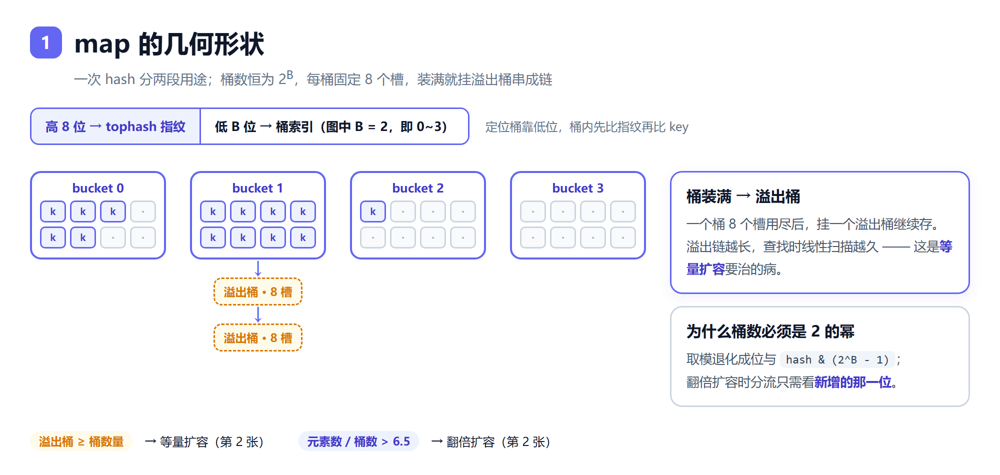
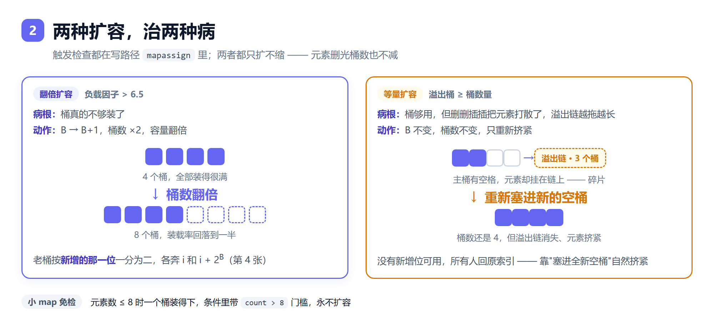
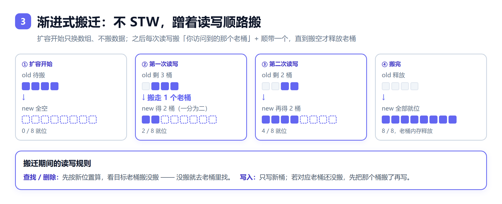
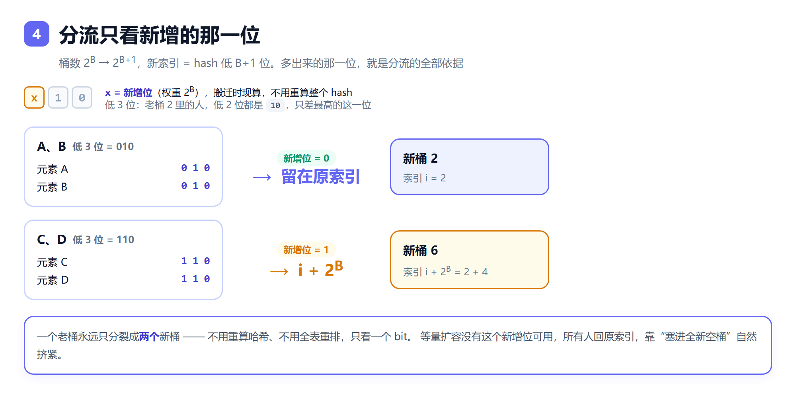
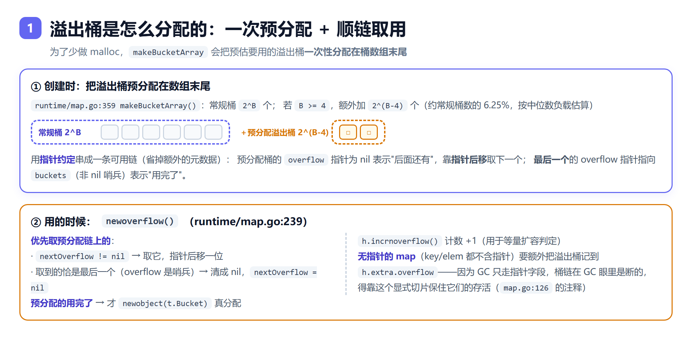
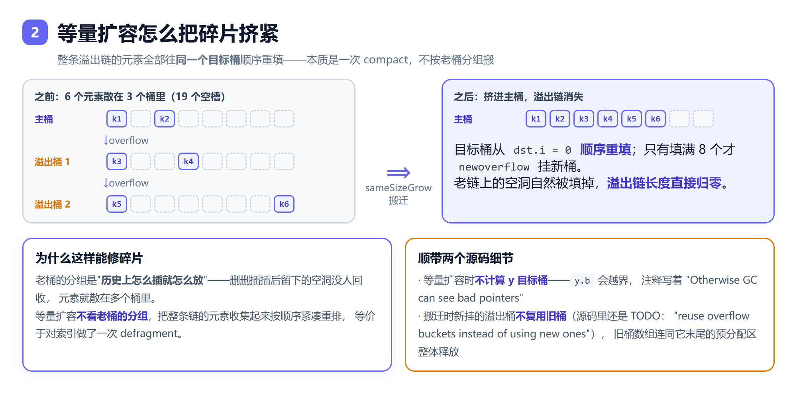
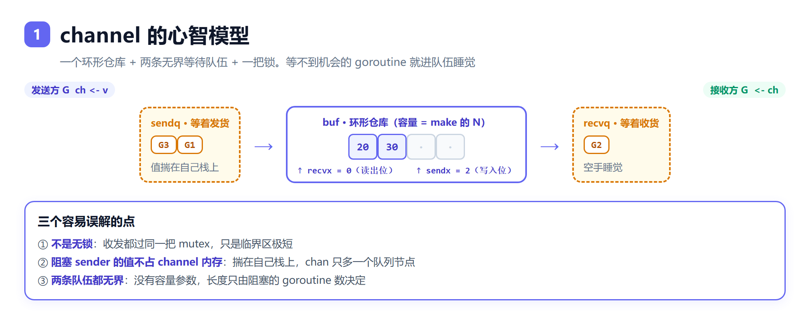
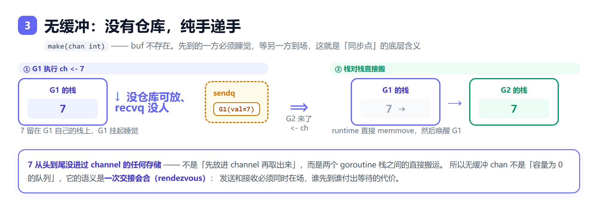

# 2026.09.07 深信服数据平台后端

## 1. map 扩容机制、有序还是无序、为什么无序

### 底层结构

- Go map 底层是 **哈希表**：`hmap`（表头）+ 一组 `bmap`（bucket，每个 bucket 存 8 个 key/value 对，外加 tophash 数组和 overflow 指针）。
- 查找流程：key 经哈希函数得 hash 值 → 低 B 位定位 bucket → 高 8 位（tophash）在 bucket 内快速筛选 → 逐槽位比对 key → 没找到沿 overflow 链表继续找。



### 扩容机制

触发条件（满足其一）：

- **负载因子过高**：元素个数 / bucket 数量 > 6.5，触发**增量扩容（doubling）**，bucket 数翻倍（B + 1）。
- **overflow bucket 过多**：删除多、插入多导致 overflow 链过长，但元素总量没超负载因子，触发**等量扩容（same-size grow）**，bucket 数不变，重新排列元素收紧 overflow 链。



扩容是**渐进式（incremental）**的：

- 扩容时不一次性搬迁所有数据（会 STW 太久），而是先把新 bucket 数组准备好，之后**每次对 map 的读写操作只做 1~2 个 bucket 的搬迁**。
- 搬迁期间查找要同时查旧表和新表；写操作只写新表。
- `hmap` 上有 `oldbuckets` 指针存旧表，全部搬完才释放。





### 追问：「溢出桶 ≥ 桶数量」具体怎么判定？（Go 1.23 源码）

判据不是一个精确计数比大小，而是「**近似计数**」配「**被夹住的阈值**」：

```go
// runtime/map.go:1190
func tooManyOverflowBuckets(noverflow uint16, B uint8) bool {
	if B > 15 {
		B = 15                                // 夹到 15
	}
	return noverflow >= uint16(1)<<(B&15)     // 阈值 = 2^min(B,15)
}

// runtime/map.go:220  每分配一个溢出桶（newoverflow）调一次
func (h *hmap) incrnoverflow() {
	if h.B < 16 {
		h.noverflow++                         // 桶少：精确 +1
		return
	}
	mask := uint32(1)<<(h.B-15) - 1           // 桶多：以 1/2^(B-15) 的概率 +1
	if uint32(rand())&mask == 0 {
		h.noverflow++
	}
}
```

- `hmap.noverflow` 是 **uint16**（最大 65535），为的是让"每个 map 一份"的 hmap 头部保持小。
- **两个分支是配套的**，不是魔法数：B ≥ 16 时存储值被缩放成真实值的 1/2^(B-15)，而阈值被夹到 2^15，两边一通分永远等价于「溢出桶 ≥ 常规桶数」：

  ```
  真实溢出桶 O，存储值 N ≈ O / 2^(B-15)
  判据 N ≥ 2^15  ⟺  O / 2^(B-15) ≥ 2^15  ⟺  O ≥ 2^B
  ```

- 为什么阈值取「约等于桶数量」：太低会白干活（反复触发重排），太高则"涨了又缩"的 map 会攥着大量无用溢出桶不放。
- **触发点在 `mapassign` 开头**（map.go:694），与负载因子是 OR 关系，且已在扩容中就不重复触发：

  ```go
  if !h.growing() && (overLoadFactor(h.count+1, h.B) || tooManyOverflowBuckets(h.noverflow, h.B)) {
      hashGrow(t, h)
  }
  ```

- `hashGrow`（map.go:1161）和 `mapclear`（`clear(m)`，map.go:1111）里都会 `h.noverflow = 0`——计数器每轮重开。
- 同源细节：`overLoadFactor` 是 `count > 8 && count > 6.5 × 2^B`，而 **6.5 = 8 × 13/16**，即桶槽位 81.25% 的装载率（`loadFactorNum = 2*8*13/16 = 13`，`loadFactorDen = 2`）。

### 追问：溢出桶是怎么分配的？（预分配 + 顺链取用）



**创建时就预分配**（`runtime/map.go:359 makeBucketArray`）：

```go
base := bucketShift(b)          // 常规桶 2^B
nbuckets := base
if b >= 4 {                     // 小 map 溢出桶概率低，跳过计算
    nbuckets += bucketShift(b - 4)   // 额外预分配 2^(B-4) 个（约常规桶数 6.25%）
    sz := t.Bucket.Size_ * nbuckets
    up := roundupsize(sz, !t.Bucket.Pointers())   // 按 size class 向上取整
    if up != sz { nbuckets = up / t.Bucket.Size_ }
}
// 预分配区紧跟在常规桶数组【末尾】，nextOverflow 指向它
nextOverflow = (*bmap)(add(buckets, base*uintptr(t.BucketSize)))
last := (*bmap)(add(buckets, (nbuckets-1)*uintptr(t.BucketSize)))
last.setoverflow(t, (*bmap)(buckets))   // 最后一个用【非 nil 哨兵】标记"用完了"
```

用**指针约定**串成可用链，省掉额外元数据：预分配桶的 `overflow` 为 nil 表示"后面还有"，靠**指针后移**取下一个；**最后一个**的 overflow 指向 `buckets`（非 nil 哨兵）表示到底了。

**取用时**（`runtime/map.go:239 newoverflow`）：

```
h.extra.nextOverflow != nil ?
  ├─ 是 → 取它，指针后移一位
  │        └─ 若取到的恰是最后一个（overflow 是哨兵）→ 清成 nil，nextOverflow = nil
  └─ 否 → newobject(t.Bucket) 真分配（预分配用完了才走这里）
h.incrnoverflow()        // 计数 +1，用于等量扩容判定
```

**一个容易漏的点**：**无指针的 map**（key 和 elem 都不含指针）要额外把溢出桶记进 `h.extra.overflow`。原因见 `map.go:126` 的注释——这种情况桶类型被标记为"不含指针"，GC 就不扫它了，但 `bmap.overflow` 本身是个指针，**GC 只走指针字段，桶链在 GC 眼里是断的**，所以得用这个显式切片保住溢出桶的存活。`oldoverflow` 同理用于 `h.oldbuckets`。

### 追问：溢出桶过多触发的等量扩容，搬迁时怎么做的？



核心就在 `evacuate()` 里这几行（`runtime/map.go`）：

```go
var xy [2]evacDst
x := &xy[0]                                  // 只算 x
x.b = add(h.buckets, oldbucket*BucketSize)

if !h.sameSizeGrow() {                       // ★ 只有翻倍扩容才算 y 目标桶
    y := &xy[1]; y.b = add(h.buckets, (oldbucket+newbit)*BucketSize)
}

for ; b != nil; b = b.overflow(t) {           // 遍历老的【整条溢出链】
    for i := 0; i < bucketCnt; i++ {
        var useY uint8
        if !h.sameSizeGrow() {                // ★ 等量扩容时这整段被跳过
            hash := t.Hasher(k2, h.hash0)
            if hash&newbit != 0 { useY = 1 }   // 翻倍扩容：看新增位分流
        }
        dst := &xy[useY]                       // 等量扩容：useY 恒为 0 → 全去 x
        if dst.i == bucketCnt {                // 目标桶填满 8 个才挂新溢出桶
            dst.b = h.newoverflow(t, dst.b); dst.i = 0
        }
        dst.b.tophash[dst.i&(bucketCnt-1)] = top
        ...拷贝 key / elem...
        dst.i++                                // ★ 顺序推进的写入位置
    }
}
```

**秘密就在 `sameSizeGrow()` 为真时 `useY` 永远是 0**：整条老溢出链的元素全部往**同一个目标桶**搬，而且从 `dst.i = 0` **顺序重填**，满了 8 个才挂新溢出桶。老桶里的空洞被自然填掉。

**本质**：等量扩容**不按老桶的分组搬**，而是把"主桶 + 整条溢出链"的元素摊平后从头紧凑重排——**一次 compact（defragment）**。老桶的分组是"历史上怎么插就怎么放"，删删插插留下的空洞没人回收，元素才散在多个桶里；重排一次就消除了。

**两个源码细节**：

- 等量扩容时**不计算 y 目标桶**——`y.b` 会落在 `oldbucket + 2^B` 处，而新数组大小和旧的一样，这个位置越界，注释写着 "Only calculate y pointers if we're growing bigger. Otherwise GC can see bad pointers."
- 搬迁时新挂的溢出桶**不复用旧桶**（源码里还留着 TODO："reuse overflow buckets instead of using new ones, if there is no iterator using the old buckets"）；搬完后旧桶数组连同它末尾的预分配区整体释放。

### 有序还是无序？

**无序**，而且是**故意设计成无序**：

- 每次 `for range map` 遍历的起点 bucket 是**随机选择**的（runtime 显式引入随机化），两次遍历顺序可能不同。
- 官方 spec 明确不保证遍历顺序。

### 为什么不做成有序？

- 哈希表的核心诉求是 O(1) 查找，有序性需要额外维护（红黑树/跳表/插入序链表都会增加内存和维护开销）。
- Go 团队**故意随机化遍历顺序**，是为了防止用户写出依赖遍历顺序的代码——早期版本顺序恰好是稳定的，很多人误以为是承诺，后来主动加随机化来打破这种隐性依赖。
- 如果需要有序遍历，正确姿势是：取出所有 key → `sort.Slice` 排序 → 按序访问；或用有序 map 库（如 `google/btree` 或第三方 linked-map）。

### 追问：扩容搬迁是深拷贝还是浅拷贝？

- **bucket 存储层面是"深"的**：新 bucket 数组整块新分配，`evacuate()` 用 `typedmemmove` 把旧 bucket 每个 kv 槽位的比特位搬过去，搬完旧数组释放——这也是扩容期间内存临时翻倍的原因（两份 bucket 并存）。
- **value 语义层面是"浅"的**：按位搬迁意味着 value 若是 `*T` / slice / map，搬走的只是指针或 header，底层对象不会复制一份。
- **为什么这里的"浅"不出问题**：深浅拷贝的坑只在"两个存活对象共享底层数据"时存在；扩容是搬家不是复制，旧 bucket 搬完即释放，外部逻辑上自始至终只有一个 map，不存在共享窗口。
- **对比 C++**：`std::unordered_map` rehash 会对每个元素调移动/拷贝构造函数（可做真深拷贝）；Go 没有拷贝构造函数，map 内部搬迁就是纯 memmove——**Go 一切拷贝都是浅语义，深拷贝必须显式做**，这原则在 map 内部同样成立（和第 2 题同源）。

---

## 2. 深拷贝、浅拷贝

- **浅拷贝**：只复制对象本身/顶层结构，对象内部的引用类型字段仍共享同一份底层数据。
- **深拷贝**：连同指向的子对象一起递归复制，新旧对象完全独立。

### Go 里的体现

Go 的赋值规则是**按值拷贝**：

- **值类型**（int、struct、array）：赋值/传参时拷贝整个值，是天然的深拷贝（前提是 struct 里没有引用类型字段）。
- **引用类型**（slice、map、chan、指针、interface、func）：拷贝的是"头部"（slice 是 `{ptr, len, cap}` 三元组、map 是指向 hmap 的指针），底层数据仍共享 → **浅拷贝**。

```go
a := []int{1, 2, 3}
b := a          // 浅拷贝：b 和 a 共享底层数组
c := make([]int, len(a))
copy(c, a)      // 深拷贝底层数组元素，但元素本身若是指针仍共享目标

m1 := map[string]int{"a": 1}
m2 := m1        // 浅拷贝：改 m2["a"] 会影响 m1
// map 没有内置深拷贝，要手动 new + 遍历塞入
```

### struct 里的坑

```go
type T struct {
    nums []int
    m    map[string]int
}

t1 := T{nums: []int{1}, m: map[string]int{"x": 1}}
t2 := t1        // struct 整体按值拷贝，但 nums 底层数组和 m 仍共享！
t2.nums[0] = 99 // t1.nums[0] 也变成 99
```

**结论**：struct 按值拷贝 ≠ 深拷贝——只要字段里有引用类型就共享底层。需要真正深拷贝时：

- 手动逐字段复制引用字段（`copy` slice、重建 map）；
- 序列化再反序列化（JSON/gob，通用但慢）；
- 用 `copier`/`deepcopy` 等库。

### 面试一句话

Go 只有浅拷贝语义（值拷贝 + 引用头部拷贝）；深拷贝永远要显式做。slice 用 `copy(dst, src)`，map 只能手动遍历重建；struct 里嵌了引用类型照样共享，这是最常见 bug 来源。

---

## 3. 为什么选 Doris 不选 ClickHouse（项目题）

> 陷阱是背"Doris vs CK 对比表"（面试官听过一百遍）。正确姿势是**用系统的具体需求当判据**，让选型看起来是推导出来的。

### 场景的三个硬需求（判据先行）

```
需求①：写入侧 upsert 幂等
  DLQ 重放 / rebalance 重复消费 / offset 回拨补数 → 大量重复写入
  → 必须同 key 覆盖收敛，不能出重复行

需求②：多来源写同一行、列级合并
  status_monitor 四个来源（fff/fdr/fcl/bag）各写各的列
  对账表 decode/consume 两侧独立写入、互补对齐 ★最独特的需求

需求③：并发导入事务 + MySQL 协议
  熔断器要事务闸门（max_running_txn_num_per_db）
  对账/汇总 ETL 走 MySQL 协议直连
```

### 选型答案（完整版，2 分钟）

"选 Doris 是被三个写入侧需求决定的，不是查询性能——查询上 CK 的向量化确实更强，但我们的瓶颈和差异点都在写入：

**第一，upsert 幂等**。我们的链路是 at-least-once——DLQ 重放、rebalance 重复消费、offset 回拨补数都会产生重复写入，所以核心业务表用 **UNIQUE KEY + MOW**，写入即覆盖、查询永远正确。CK 的 ReplacingMergeTree 是 **merge-on-read**——重复行先落表、后台 merge 才收敛，查询不加 FINAL 能看到重复。我们要做对账和按 uuid 精确计数的场景，这个语义差异是致命的：DLQ 回放进 CK，对账窗口内重复行是真实存在的，看板口径会漂。

**第二，也是最独特的：对账表的多来源列级合并**。decode 侧和 consume 侧是两个独立写入方，各写各的列、写同一行，靠 **AGGREGATE KEY + REPLACE_IF_NOT_NULL** 互补对齐——Doris 的列级聚合函数直接表达这个语义。CK 的 AggregatingMergeTree 只对整列做聚合（sum/argMax），没有"两个写入方各覆盖各的列、互补不冲突"的原生对应物，得靠外部编排保证时序——复杂度转移到应用层。

**第三，事务语义**。熔断器依赖 `max_running_txn_num_per_db` 这个并发导入闸门做保护，Stream Load 有 BEGIN→COMMIT 事务边界、响应里有五段耗时可以精确观测。CK 没有导入事务的概念——异步 insert 的原子性是块级的，拿不到"并发在途事务数"这个熔断的输入信号。

另外**生态契合**：MySQL 协议直连（对账 ETL、汇总重刷都走 SQL），运维上和现有工具链零成本对接。

反过来说，CK 赢在哪我们也很清楚：纯查询性能（向量化执行、物化视图实时聚合）、社区生态（字节快手都在重度使用）。如果我们的场景是"写完主要做大规模聚合查询、更新少、对账用别的方式做"，CK 是更好的选择。**选型的本质是写入语义跟着可靠性设计走——我们把幂等押在存储层，Doris 的三个表模型（UNIQUE/AGGREGATE/DUPLICATE）正好给了我们按表配语义的能力。**"

### 追问弹药

| 追问 | 答案 |
|---|---|
| "CK 查询不是更快吗？" | "是，纯查询 CK 更快。但我们写入和更新是正确性依赖（对账、幂等），查询是性能需求——正确性优先于性能做选型，且 Doris 的查询性能对我们毫秒级看板足够（汇总层预聚合后更无压力）" |
| "MOW 写入有查重开销，你吃得消吗？" | "吃得消，但代价我们真实付过——5/28 事故就是 MOW 查重 + compaction 压力，所以才有 cooldown、熔断、批次节奏调优。这是选 Doris 的代价面，我们用它但承认它" |
| "为什么不两个都用？CK 查 Doris 写？" | "评估过，最终否了——数据双写的一致性成本、双组件运维、而我们没有 CK 才能满足的查询场景。等真有 ad-hoc 大规模探索需求时，Paimon 挂 Doris catalog 是更现代的湖仓路线，不用引入 CK" |
| "你们单 BE 不是打挂过吗？这算选型失误吗？" | "那是容量规划问题不是引擎问题——3 BE 分摊 tablet 后那个事故大概率不发生。选型选的是引擎的能力模型，部署给不给资源是另一个决策" |

### 一句话版（30 秒）

"三个写入侧需求决定的：at-least-once 链路需要 MOW 写入即幂等（CK 是 merge-on-read，查询可见重复行）；对账表两个写入方列级互补合并需要 REPLACE_IF_NOT_NULL（CK 没有对应物）；熔断器需要导入事务信号（CK 无事务概念）。CK 赢在查询性能，但我们的瓶颈和正确性都在写入——**选型跟着写入语义走**。"

---

## 4. 为什么选 TiDB，MySQL 也能两阶段提交（项目题）

### 先纠正概念：两个"两阶段提交"不是一个维度的东西

| | MySQL 的 2PC | TiDB 的 2PC（Percolator） |
|---|---|---|
| **解决什么** | 单机引擎内部 redo log 和 binlog 的一致性（内部 XA） | 跨节点分布式事务的原子提交 |
| **协调者** | MySQL 内部（binlog 作为协调者） | TiDB Server（primary key 仲裁） |
| **参与者** | 同一进程里的 InnoDB 和 binlog 模块 | 多台 TiKV 上的多个 region |
| **挂了会怎样** | 崩溃恢复时靠 redo/binlog 对齐，单机问题 | 靠 primary key 状态 + Raft 多数派恢复 |

MySQL 的 2PC 是"一个事务写两种日志别写劈叉了"——**单机内部一致性**；TiDB 的 2PC 是"一个事务的数据散在多台机器上怎么要么全提交要么全回滚"——**分布式一致性**。所以"MySQL 也有 2PC"放到 MySQL 集群上**不成立**——MySQL 集群（主从/分库分表）恰恰**没有跨机事务**，这正是选 TiDB 的第一动机。

### 真实选型账：不用 TiDB，MySQL 只有三条路，都有硬伤

**路线 1：单机 MySQL**

```
数据量：亿级用户 × 90天 token 窗口 ≈ 数百 GB~TB
单表千万行就性能拐点 → 必然要拆
```

**路线 2：MySQL 分库分表（Java 团队的老路）**

```
✅ 应用层 64/128 分表已经做了（代码就是证据）
❌ 但分库之后：
   - 跨库事务没有：一个用户的数据拆在多个库，操作跨表只能放弃事务
     （这就是"为什么 UpdateUserInfo 不加事务"：不是不想，是分表加不了）
   - 跨库 join 全部要应用层聚合
   - 扩容要迁移数据：64 → 128 分表 = 全量重哈希重导，停机窗口
   - 主从复制异步：failover 丢已确认数据（RPO>0）
```

**路线 3：MySQL 集群方案（MGR/Galera）**

```
❌ 同步复制写放大严重、吞吐天花板低
❌ 分片能力弱（MGR 不做自动分片）
❌ 运维复杂度不比 TiDB 低
```

**TiDB 一次补齐的四个能力**：

| 能力 | MySQL 分库分表 | TiDB |
|---|---|---|
| 跨分片事务 | ❌ 没有 | ✅ Percolator 对业务透明 |
| 在线扩容 | ❌ 全量迁移 | ✅ 加节点自动 rebalance region |
| 高可用 | 异步复制 RPO>0、手工切主 | ✅ Raft 多数派、自动选主、RPO=0 |
| 兼容 MySQL 协议 | — | ✅ 迁移成本低（敢迁的先决条件） |

### 诚实的另一半：选 TiDB 的代价（面试这么说才可信）

```
① 单条小事务更慢：一次 UPDATE 要 Prewrite+Commit 两次跨网络 + Raft 多数派确认
   （3-8ms vs MySQL 单机 ~1ms）——用单条延迟换横向扩展
② 运维复杂度：PD/TiKV/TiDB Server 三组件 + region 调优
③ 我们的用法其实没吃满 TiDB：应用层 64 分表是 MySQL 时代的包袱，
   TiDB 原生 region 自动分片本可替代（迁移求稳保留的）
```

第三条正是面试陷阱"为什么 TiDB 上还做应用层分表"的答案——**Java/MySQL 迁移的历史包袱，行为契约照抄保兼容**。

### 追问：分布式 2PC 为什么难做？（3PC 为什么也救不了）

**根子一句话**：2PC 是个**阻塞式**协议，正确性押在"协调者不会挂、网络最终会通"两个假设上——而这俩在分布式环境里恰恰不成立。它想解决的问题（让多个独立节点达成一个不可逆的原子决定）本质是**共识问题**，但 2PC 不是共识协议，它靠假设绕过了共识。

**三个卡死场景**：

```
场景1｜协调者在关键窗口挂了（最经典）
T1 协调者 → 全部参与者：prepare
T2 参与者：执行、写日志、加锁、回 "yes"
T3 协调者：收齐 yes，写"全局提交"日志
T4 协调者 → 参与者：commit        ↑ 崩在这里
   参与者已投 yes、持着锁、却不知道最终决定 → in-doubt 存疑状态
   锁不释放 → 其它事务全排队 → 连接池耗尽 → 服务雪崩
   （若协调者本地日志也坏 = 参与者永久阻塞，只能人工介入）

场景2｜二阶段广播中断 → 部分提交
T4 协调者 → P1：commit ✅   ↑ 崩在这里（P2/P3 没收到）
   P1 已提交、P2/P3 停在 prepare → 原子性被破坏

场景3｜参与者宕机 + 超时后的"启发式决定"
   参与者猜着提交或回滚 → 猜错就和其他参与者相反，且无自动修复机制
```

**性能账**（也是硬伤）：

| 成本 | 说明 |
|---|---|
| 两次网络往返 | prepare 一次、commit 一次 |
| 两次同步落盘 | prepare 和 commit 都要持久化 |
| 锁持有时间长 | 从 prepare 到 commit 全程持锁 |
| **木桶效应** | 整体延迟由最慢的参与者决定 |
| **尾延迟放大** | 参与者越多，出现慢节点的概率越大，P99 很难看 |

**3PC 为什么救不了**：它加了 pre-commit 阶段，让参与者在协调者挂掉后能自行推进，减少阻塞——但**解决不了网络分区**：网络切成两半时，一边收到 pre-commit、一边没收到，两边各自决定就可能相反。经典结论：**网络分区存在时，2PC/3PC 都无法同时保证一致性和可用性**，要突破必须引入多数派（Paxos/Raft）。3PC 还多一次往返，工程上基本没人用。

**现代怎么绕（六条路，三类思路）**：

| 思路 | 方案 | 代表 |
|---|---|---|
| 避免 | 把事务控制在单分片内 | 各库的 1PC 优化 |
| 弱化 | 一阶段**直接提交** + undo_log 补偿 | **Seata AT** |
| 弱化 | 业务层 Try/Confirm/Cancel | **TCC** |
| 弱化 | 长事务拆成一串本地事务 + 补偿 | **Saga** |
| 不用 | 本地消息表 / 事务消息 + 最终一致 | **RocketMQ 事务消息** |
| **共识兜底** | 分片事务仍用 2PC，但**决定本身由 Raft 保证可靠** | **TiDB Percolator + Raft** |

最后一条最优雅，也正是上面 TiDB 那题的底层逻辑：

```
2PC 的病：协调者单点、决定会丢
  → 不要中心协调者：仲裁点下沉到 primary key（Percolator）
  → 让"决定"可恢复：primary 的状态由 Raft 保证不丢
  → 2PC 负责跨分片原子性，Raft 负责每个决定的可靠性
```

**2PC 和 Raft 不是替代关系，是分工**：2PC 管"多个分片怎么一起提交"，Raft 管"每个决定在副本间不丢"。单用 2PC 会在协调者故障时卡死，单用 Raft 解决不了跨分片原子性。

### 追问：MySQL 的 XA（分布式 2PC）具体难在哪？

通用 2PC 的阻塞问题之外，MySQL 的 XA 实现还有**四个特有坑**：

**① 锁从 `XA PREPARE` 持到最终决定（最致命）**

```sql
XA START 'x1';
UPDATE account SET balance = balance - 100 WHERE id = 1;   -- 行锁已加
XA END 'x1';
XA PREPARE 'x1';     -- ★ 进入 prepared，但锁【继续持有】
      ... 等 TM 最终决定，几百 ms ~ 几秒 ...
XA COMMIT 'x1';      -- 到这里锁才释放
```

普通事务持锁时间 = 应用自己的处理时间（毫秒级）；XA 持锁时间 = **整个分布式事务周期**（含其它服务的业务处理 + 其它库的 prepare + TM 做决定 + 指令传递）。跨三四个服务的一次下单，几百毫秒到几秒很正常，这几秒里被锁的行上所有事务排队；`innodb_lock_wait_timeout` 默认 50s，超时即报错，并发一上来就雪崩。

**② in-doubt 事务没有超时和自动清理**

```sql
XA RECOVER;            -- 列出所有 prepared 状态的 XA 事务（只有一个 xid）
XA COMMIT 'xid';       -- 还是 XA ROLLBACK 'xid'？只能人工判断
```

- **不会超时清理**：prepared 的 XA 事务可以永远挂着（普通事务有各种超时，它没有）。
- **MySQL 无法自决**：该提交还是回滚是 TM 的职责，TM 记录丢了就只能人工介入。
- **判错了永久不一致**：猜着提交/回滚，和别人反了没有自动修复机制。

对比：单机 MySQL 的崩溃恢复**完全自动**（看 binlog 完整性）。**XA 把一个能自动解决的问题变成了要 DBA 值班的问题。**

**③ 僵尸事务卡住 purge → undo 表空间膨胀（运维最痛）**

purge 只能清理"比系统里最老活跃事务还老"的 undo 版本。一个 prepared 的 XA 事务挂着，它的 `trx_id` 就永远是最老的：

```
僵尸 XA 事务
  → purge 推进不动
  → undo 版本链越堆越长，undo 表空间持续膨胀（可涨到几十上百 GB）
  → 所有查询遍历更长的版本链 → 整体变慢
  → 只能重启实例或杀掉事务
```

线上"undo 空间莫名上涨 + 查询莫名变慢"，排查方向之一就是 `XA RECOVER`。

**④ 内部 2PC 套外部 2PC：binlog / 主从交互复杂**

```
普通事务： 内部 2PC（redo prepare → binlog → redo commit）
XA 事务：  外面再套一层 2PC，内部 2PC 嵌在里面
```

`XA PREPARE` 之后的分支：存储引擎里是 prepared（redo 已写、锁已持），binlog 里也要有对应记录，从库重放的状态要和主库一致。**这个"内 2PC 套外 2PC"是历史 bug 高发区**（5.5/5.6 有过 XA + binlog 导致主从不一致的问题，5.7 后才逐步完善）——这也是很多人对 XA 有心理阴影的原因。

**实践结论：能不用 XA 就不用。** 替代思路都是避免"长时间持锁等最终决定"：

| 方案 | 怎么绕开 |
|---|---|
| **Seata AT** | 一阶段**直接提交本地事务**（不 prepare、不持锁），用 undo_log 补偿模拟回滚 |
| **TCC** | Try 只做资源预留，Confirm/Cancel 是短事务 |
| **本地消息表 / RocketMQ 事务消息** | 不搞分布式事务，用**最终一致** |
| **Saga** | 长事务拆成一串短本地事务 + 补偿 |
| **减少分支** | 分片键设计，让事务落在单库单表（走 1PC） |

MySQL 8.0.30 之后加了 **`XA DETACH`**（会话可脱离 XA 事务、由别的会话提交）缓解长连接/连接池场景的问题，但**"锁持有到最终决定"这个根本病没变**。

**面试一句话**："XA 把 MySQL 本来能自动完成的崩溃恢复，变成了需要人工判断的悬案；又把锁持有时间和跨服务的业务耗时绑在了一起。所以微服务里我们宁可用 Seata AT 或者最终一致，也不用 XA。"

### 面试 60 秒版本

"MySQL 的两阶段提交是引擎内部 redo log 和 binlog 的对齐，是**单机内部一致性**；它解决不了集群的问题——MySQL 分库分表后跨库事务就不存在了。我们用户中台亿级数据必然要拆，拆了之后跨表操作、在线扩容、RPO=0 的高可用全是缺口。TiDB 的 Percolator 两阶段是**跨节点的分布式事务**，加 MySQL 协议兼容，等于把分库分表的四个痛点一次补齐。代价也要说：单条小事务比 MySQL 单机慢（两次跨网络 + Raft），而且我们应用层 64 分表是 MySQL 时代包袱，TiDB 的 region 自动分片本可以替代它——迁移期保留是为了行为兼容。**所以准确说法是：不是 TiDB 比 MySQL 强在事务，是 MySQL 集群化没有一套完整的分布式事务故事，TiDB 有。**"

### 一句话版

MySQL 的 2PC 是单机内部 redo/binlog 对齐，TiDB 的 2PC 是跨节点分布式提交——**不是一个层面的东西**；选 TiDB 选的是"分片后仍有跨分片事务 + 在线扩容 + Raft RPO=0 + MySQL 协议兼容"这整套，单条延迟变慢和应用层分表包袱是明码标价的代价。

---

## 5. TCP / IP / MAC 在哪一层，NAT，TCP 连的是什么，ARP，路由器的作用

### 五层模型对应

| 协议 | 所在层 | 干什么 |
|---|---|---|
| **TCP** | 传输层（L4） | 端到端可靠字节流、面向连接、流量控制、拥塞控制（端口号在这一层） |
| **IP** | 网络层（L3） | 主机到主机的逻辑寻址和路由转发，把包送到目标**主机** |
| **MAC** | 数据链路层（L2） | 同一**局域网/链路**内的寻址，把帧送到直连的下一跳 |

### 公网 IP 转内网 IP 用的什么 —— NAT/NAPT

- **NAT**（Network Address Translation）：路由器/网关在转发时把报文里的私网 IP 换成公网 IP，回程再换回来。
- 实际上是 **NAPT（端口地址转换，PAT）**：一个公网 IP 复用给多台内网机器，靠 **(内网IP, 内网端口) ↔ (公网IP, 公网端口)** 的映射表根据端口区分。
- 转换发生在**网络层/传输层**的设备上（家用路由器、企业出口网关、云上的 NAT 网关）。
- 内网网段：`10/8`、`172.16/12`、`192.168/16`，这些地址在公网上不可路由。

### TCP 连接用的是 IP 还是 MAC？

**连接四元组用的是 IP**(源 IP、源端口、目的 IP、目的端口），TCP 本身只认 IP+端口，**不认 MAC**。

- TCP 层的"连接"是逻辑上的四次四元组 + 状态机，完全建立在 IP 层之上。
- MAC 只在**链路层每次转发一跳时**使用，并且**每过一跳就重写**（源 MAC 变成本跳出口、目的 MAC 变成下一跳）。
- 数据报穿越多个路由器：IP 首部的源/目的 IP 不变，MAC 首部的源/目的 MAC 逐跳改变。

**一句话**：TCP 连的是 IP；MAC 只是每一跳在局域网里把帧交给下一跳的"送达地址"，不是"连接"的对象。

### ARP 是什么

- **ARP（Address Resolution Protocol）**：同一局域网内，**已知 IP 求 MAC** 的协议。
- 流程：要发 IP 包给 `192.168.1.10` → 查 ARP 缓存，没命中 → 广播 ARP Request（"谁的 IP 是 192.168.1.10，请告诉我你的 MAC"）→ 目标单播 ARP Reply → 写进 ARP 缓存（默认几分钟老化）。
- 出口判断：源主机用**子网掩码**判断目标 IP 是否同网段——同网段 ARP 求目标 MAC；不同网段 ARP 求**默认网关（路由器）的 MAC**，把帧交给路由器去转发。
- 对应反向的协议叫 RARP（已基本淘汰）；IPv6 里被 NDP（ICMPv6 邻居发现）取代。
- 面试加分：ARP 是**链路层和网络层之间**的辅助协议（常以 L2.5 说），存在 ARP 欺骗/ARP 中间人攻击。

### 路由器的作用

- **跨网段转发**：用路由表（前缀匹配 + 最长子网匹配）决定把包从哪个口发出去，把不同网络连起来。
- **隔离广播域**：每个接口一个广播域，不会把局域网的 ARP 广播、二层广播风暴扩散到别的网段。
- **路径选择**：跑路由协议（OSPF/BGP）学习全网拓扑，选最优路径。
- **附加职责**：NAT 转换、ACL 防火墙过滤、DHCP 下发、QoS、VPN 隧道等。
- **和交换机的区别**：交换机工作 L2（看 MAC 表转发帧，同一网段内），路由器工作 L3（看路由表转发 IP 包，跨网段）。家用"路由器"其实是 路由器+交换机+AP+NAT 四合一。

### 串起来：一个 TCP 包从内网到公网的旅程（面试画图话术）

```
1. APP 把数据交给 TCP：
   报头写 (srcIP=10.0.0.5:12345, dstIP=142.250.x.x:443)
2. TCP 报文分片成 IP 包：
   源/目的 IP 锁定不变
3. 判断目的 IP 不在本地网段 → ARP 求默认网关 10.0.0.1 的 MAC
   帧头：srcMAC=本机网卡, dstMAC=路由器 LAN 口 MAC
4. 路由器收到帧、剥掉 MAC 头、看 IP 头做 NAT：
   srcIP 换成公网 100.x.x.x，端口映射进 NAT 表
5. 路由器查路由表转发到下一跳 → 同样的过程：IP 不变，MAC 重写
6. 一路上每跳路由器干这事，直到对端主机
```

---

## 6. 三次握手能变两次吗？四次挥手能变三次吗？

### 三次握手能变两次吗？—— 不能

先回顾三次握手：

```
Client                                    Server
  SYN (seq=x)              →
  ←                SYN+ACK (seq=y, ack=x+1)
  ACK (seq=x+1, ack=y+1)   →
```

少一次会有什么问题？

**核心目的**：两端都要确认对方的**收发能力正常**，并且**同步双方的初始序列号（ISN）**。

- 第一次 SYN：Client 证明自己"能发"，Server 收到后知道 Client 能发。
- 第二次 SYN+ACK：Server 证明自己"能收 + 能发"。此时 **Server 视角**还不知道 Client 的接收能力。
- 第三次 ACK：Client 回收到 SYN+ACK 后的应答——这一步让 **Server 确认 Client 能收**；唯有此时 Server 才敢进入 ESTABLISHED。

**变两次会发生什么**：Server 收到 SYN 直接进 ESTABLISHED。

- **失效历史连接问题**：如果 Client 之前的某个 SYN 因为网络延迟姗姗来迟（可能是几十秒前发的重传包），Server 会误当新连接，白白分配资源一直等待——这就是"**已失效的连接请求又传到 Server，产生错误**"。
- **安全性**：两次握手下 Server 无法防御 **SYN 洪泛攻击**（伪造源 IP 发 SYN，Server 直接进 ESTABLISHED 占资源等永远不会来的 ACK），三次握手至少让 Server 处于半连接状态（有专门的半连接队列和超时回收）。

**反向追问"四次行不行"**：可以，TCP 早期就是为四次（SYN / ACK / SYN / ACK 分开），第三次把 SYN 和 ACK "捎带"合并成 SYN+ACK 才变成三次——所以"三"是**能省则省的最小值**，再省就破坏"双方都要确认对方收发能力 + 同步 ISN"的目标了。

### 四次挥手能变三次吗？—— 能

四次挥手：

```
主动关闭方                                被动关闭方
  FIN (seq=u)              →
  ←                ACK (ack=u+1)
  ←                FIN (seq=v)              ← Server 处理完剩余数据后才发
  ACK (ack=v+1)            →
```

为什么默认是四次：**TCP 是全双工**，两个方向独立关闭。被动关闭方收到 FIN 时只代表"对方不再发数据了"，自己**可能还有数据没发完**——所以先回 ACK，等应用把剩余数据发完才发 FIN。ACK 和 FIN 之间可间隔任意久，所以**不能默认合并**。

什么时候可以合并成三次：**被动关闭方收到 FIN 时正好也没数据要发了**，就可以把 ACK 和 FIN 一次性发出去：

```
  FIN                      →
  ←                FIN+ACK   ← 合并第2、3次
  ACK                      →
```

- Linux 中如果被动关闭方没有未发数据，内核会把 ACK 和 FIN 合并成同一个包发送（**延迟 ACK + 无数据可发**时）——抓包时经常实际看到就是三次。
- 合并的是 **第 2 次（ACK 给对方的 FIN）+ 第 3 次（FIN 给自己方向的关闭请求）**。

**不能变成两次**：最后那个 ACK 不能省——主动关闭方必须确认收到对方的 FIN，否则对方会重传 FIN 永远关不掉；而且主动关闭方自己还要进入 TIME_WAIT 兜底（防止 ACK 丢失 + 让旧包自然消亡）。

---

## 7. Channel 底层原理

### 心智模型：一个环形仓库 + 两条等待队伍 + 一把锁

忘掉结构体字段，channel 就是一个**快递站点**：

- **buf**：环形仓库，`make(chan T, N)` 的 N 是格子数；无缓冲 = 没有仓库；
- **sendq / recvq**：两条**无界 FIFO 队伍**，等不到机会的 goroutine 在这里挂起睡觉（sender 睡觉时值揣在自己栈上）；
- **一把锁**：所有收发操作都过同一把 mutex——channel **不是无锁结构**，只是临界区极短；
- 仓库里两个指针转圈：`sendx` 指向下一个写入格，`recvx` 指向下一个读取格，到头绕回——所以叫环形。



### 场景 1：仓库没满 —— 发送直接入仓，谁都不用等

```
ch := make(chan int, 4)               ch <- 20;  ch <- 30

  ┌───┬───┬───┬───┐                    ┌───┬───┬───┬───┐
  │ · │ · │ · │ · │                    │20 │30 │ · │ · │
  └───┴───┴───┴───┘                    └───┴───┴───┴───┘
  recvx=0, sendx=0                     recvx=0, sendx=2, count=2

<-ch → 从 recvx(=0) 取走 20 给接收方，recvx=1
```

发送写 `sendx` 指向的格子、接收取 `recvx` 指向的格子，两边独立推进互不阻塞——这就是"有缓冲解耦"的全部含义。

### 场景 2：仓库满了 —— sender 挂起，receiver 到场后三步联动


### 场景 3：无缓冲 —— 没有仓库，纯手递手



### 场景 4：close —— 一次性广播

```
close(ch)
  ├─ buf 里的存货不清空：之后 <-ch 仍能读到，读完才开始返回零值
  ├─ recvq 全员唤醒：每人拿到 零值 + ok=false
  └─ sendq 全员唤醒：每人的 ch<- 直接 panic("send on closed channel")
     ——这就是"不要让接收方 close"的根源：发送侧无法优雅收场
```

### 收发决策树（四个场景浓缩成两棵树）


### 三个容易误解的点

1. **channel 不是无锁的**：内部就是一把 mutex，说"channel 底层靠锁实现"反而正确——只是临界区短到可以忽略。
2. **阻塞 sender 的值不占 channel 内存**：值揣在挂起 G 自己的栈上，chan 侧只多一个队列节点。所以百万 goroutine 阻塞在发送上，吃的是 goroutine 栈内存，不是 chan 的。
3. **为什么发送先看 recvq、接收先看 buf？**（不对称但都有道理）
   - recvq 有人 ⟹ 仓库必空（有货早被取走了），直接手递手省掉入仓+出仓两次拷贝；
   - 接收先取 buf 是为了 **FIFO 保序**——否则等待 sender 的新货就插了 buf 里旧货的队。

### select 是怎么处理多个 chan 的

- 编译器把 `select` 展开成 `selectgo`：对所有 case 构建 `scase` 数组 → **随机打乱顺序**（避免饥饿）→ 逐个尝试加锁、看能否立即做 → 都不行就把当前 G 同时挂到**所有 case 的等待队列**（pollorder 排列后按全局统一顺序加多把锁，防止死锁）→ gopark 挂起 → 任一就绪后被唤醒，从其他等待队列把自己摘除，返回被选中的 case。

### range / for 和 nil chan

- `for v := range ch` 循环直到 close 才退出；close 后继续 range 会读到零值死循环前的次数仍读完 buf。
- **nil chan 读写永远阻塞**——常见技巧：`select` 里把 chan 置 nil 来"禁用"该 case。
- **常见 panic 场景**：向已关闭 chan 发送；close 已关闭的 chan。

### 追问：协程等待链表（sendq/recvq）是有限的还是无限的？

- **无界的**。buf 有 `dataqsiz`（make 时声明），但 `recvq`/`sendq` 是 FIFO 无界链表（`waitq{first, last}`，节点是 sudog），**没有任何容量字段，也没有 API 能限制长度**——队列长度完全由运行时阻塞的 goroutine 数决定。sudog 节点从 per-P 池 `acquireSudog` 取，那只是对象池化，不构成队列上限。
- **为什么敢无界**：阻塞在 chan 上的 G 被 gopark 后只留几 KB 栈，是无状态负担的挂起状态机——轻量 G 和无界等待队列是配套设计，线程模型（MB 级栈）就不敢这么干。
- **无界的代价**：生产者远快于消费者时，每个阻塞 sender = 一个挂起 G + 几 KB 栈 + 待发送值被其栈引用无法 GC → sendq 无限增长；若消费者永不出现/chan 永不 close，就是 goroutine 泄漏。且 close 是一次性广播唤醒全部等待者——队列无限长意味着无限惊群。
- **要有界等待得自己做**：固定 worker 池（goroutine 数固定即背压）、buffered chan 当计数信号量（`make(chan struct{}, N)`）、`semaphore.Weighted`、`select` + timeout/context 兜底。

### 面试总结话术

"chan 核心是 hchan：一个带互斥锁的环形 buf + 两个 sudog 等待队列。发送先看 recvq 有没有人等（有就直接手递手），再看 buf 有没有位（有就塞），否则自己挂到 sendq 上 park；接收对称。close 一次性广播唤醒两个队列，所以接收能感知关闭而发送直接 panic。无缓冲只是 buf 为 nil 的特例，强制 rendezvous。select 就是在多个 chan 的等待队列上同时入队 + 随机化顺序 + 全局锁序防死锁。"

---

## 8. K8s：Pod 生命周期、kubelet、scheduler、etcd

### Pod 生命周期（Phase）

一个 Pod 从创建到结束会经过几个 Phase，存在 `pod.status.phase` 里：

| Phase | 含义 |
|---|---|
| **Pending** | Pod 已被 API Server 接受（对象已进 etcd），但还没 ready——**要么还没被调度**（没选到 node）、**要么镜像还在拉取** |
| **Running** | Pod 被绑定到某个 Node，所有容器都被创建，且至少一个容器在运行/启动/重启中 |
| **Succeeded** | 所有容器都**正常退出且不再重启**（Job 类一次性任务跑完的终态） |
| **Failed** | 所有容器都退出，且至少一个**非零退出码**终止（Job 跑挂了 / 被 OOMKill 后不重启） |
| **Unknown** | API Server 联系不上 Node 上的 kubelet，拿不到状态（节点失联） |

> 注意 `CrashLoopBackOff`、`ErrImagePull`、`Init:0/1` 这些**不是 Phase**——它们是 container 级别的 status，Phase 仍是 Pending 或 Running；`kubectl get pod` 的 `STATUS` 列其实是 Phase 的"人性化输出"。

### 一个 Pod 从出生到干活的完整旅程（按组件串起来）

```
1. kubectl/控制器 POST Pod 对象
      ↓ 写入
2. etcd        —— Pod 落盘，此时没有 .spec.nodeName（未调度）
      ↓ 监听到 List-Watch 里有未调度 Pod
3. kube-scheduler
      - 过滤(Filter)：剔除资源不足/亲和性/nodeSelector不匹配的节点
      - 打分(Score)：剩余节点按策略排序
      - 选出最优节点，把 Pod 的 .spec.nodeName 写回 API Server（→ etcd）
      ↓ kubelet 在自己的 Node 上 Watch 到分给自己的 Pod
4. kubelet
      - CRI 调容器运行时(containerd)：Pull 镜像 → 创建 sandbox → 启动 initContainers → 启动业务容器
      - readinessProbe 通过前不会进 Service 的 Endpoints
      - 把容器状态持续回写 Pod.status（→ API Server → etcd）
5. kube-proxy
      - Watch 到 Service/Endpoints 变化，刷新本机 iptables/ipvs 规则，让流量能进来
```

### kubelet：节点的"管家"，控制循环的执行者

- 每个 Node 上一个，**唯一真正能抓到本机实物状态的组件**。
- **Watch 而不是轮询**：订阅 API Server 的 List-Watch 流，看到分到自己节点上的 Pod 变化。
- **静态 Pod**：除了 apiserver，kubelet 还会读 `/etc/kubernetes/manifests` 目录下的 yaml 直接创建 Pod（控制平面组件本身就是这样拉起来的，不需要 apiserver）。
- 职责三条线：
  1. **拉镜像 + 启停容器**（通过 CRI 调 containerd/CRI-O）；
  2. **健康探针**（exec 或 HTTP 执行 liveness/readiness，失败就触发容器重启）；
  3. **挂载卷、上报状态**（Pod 状态、Node 心跳、节点资源容量/可分配量回写给 apiserver）。
- **重启策略**：容器挂了 kubelet 按 Pod 的 `restartPolicy`(Always/OnFailure/Never)重启，但**不会主动重建 Pod**——Pod 死后由控制器（Deployment）创建新 Pod。

### kube-scheduler：只负责"选节点"

- 只解决一个问题：一个 Pending Pod **应该落到哪个 Node**。
- 两阶段：
  - **Filter（过滤）**：资源够不够（requests/limits）、nodeSelector/亲和性反亲和性、taint/toleration、端口冲突、卷可挂载性……筛掉不能去的；
  - **Score（打分）**：剩下的节点按策略打分（最少占用/均衡分布、就近 locality 等）取最高分。
- **关键是只管决策不管执行**：选中后只是**把 `.spec.nodeName` 写回 API Server**（Pod 的"绑定"），真正把容器拉起来的是该 Node 上的 kubelet——调度器和 kubelet **不直接通信**，完全通过 etcd/API Server 解耦。
- 抢占：高优先级 Pod 没地方放时，会**踢走低优先级 Pod** 腾出位置（preemption）。

### etcd：集群唯一的数据库

- 存**所有**集群状态——Pod/Deployment/Service/ConfigMap/Secret/Node 状态，全部。K8s **没有任何其他持久化存储**。
- 是个 **Raft 协议的分布式 KV 存储**：
  - 写必须过 leader，leader 复制到多数派（>N/2）才返回，**RPO=0，强一致**；
  - 典型 3 或 5 节点部署，容忍 1~2 个节点挂掉不丢数据；
  - 提供 **watch**：API Server 用它在内存里做缓存，调度器/kubelet/控制器都通过 API Server 间接感知变化。
- **垮了的代价**：etcd 不顶用了，API Server 唯一能做的读写都失败，整个集群 freeze（Pod 还在跑，但任何新变更、查询、重启都挂）；etcd 数据丢了就是整个集群状态丢，**所以要定期备份 etcd 快照**。

### 一张图记住四者关系

```
                 kubectl / Client
                        │  HTTP/REST
                        ▼
                 kube-apiserver ◄── 所有组件唯一入口，不直连 etcd 之外的世界
                        │
                        ▼
                      etcd       ←── 唯一数据库，Raft 强一致
                        ▲                ▲
              Watch/Long polling          │ 读写全部状态
    ┌────────────────────┼────────────────┼─────────────────┐
    │                    │                │                 │
kube-scheduler    kube-controller   kubelet (Node)      kube-proxy (Node)
选节点+写回        管理器            拉容器+健康检查      维护 iptables
(.spec.nodeName)  (reconcile)      + 上报状态
```

### 面试追问弹药

| 追问 | 答案 |
|---|---|
| "Pod Pending 卡住了排查思路？" | `kubectl describe pod` 看 event——镜像拉不下(ImagePullBackOff)、资源不足调度器拒绝、PVC 没绑定、亲和性不满足、taint 没容忍、端口冲突 |
| "kubelet 挂了集群会怎样？" | 该 Node 上 Pod 继续跑（容器是 containerd 管的），但新 Pod 调不上来、探针不跑了、状态上报停了；API Server 5min 左右标记 Node NotReady，控制器会把 Pod 驱逐重建 |
| "etcd 为什么不用 ZooKeeper/Consul？" | etcd 是 CNCF 自家人、API 是 gRPC+watch 语义最契合 K8s、性能针对 K8s 对象模型调优；ZS/Consul 更通用，K8s 选型贴近自身需求 |
| "scheduler 默认打分策略？" | 多维综合：剩余资源均衡、亲和性优先级、镜像本地存在与否（避免重复拉取）、Taint/Toleration 等，由 framework 插件化组合 |
| "为什么 Pod 不能直接跑容器还要这一层？" | Pod 是最小调度单元，提供共享网络命名空间（同 Pod 容器共用 IP/localhost）+ 共享存储卷 + 同 Node 强绑定，容器组粒度比单容器更适合表达"一台机器上的一组协作进程" |

### 面试 60 秒版本

"一条链窜几个组件：Pod 对象先进 etcd；scheduler 监听未调度 Pod，两轮 Filter/Score 选节点，把 `nodeName` 写回 etcd；kubelet 在自己 Node 上 Watch 到属于自己的 Pod，调 CRI 拉镜像、跑 sandbox、起容器，持续上报状态；probe 通过 + Endpoints 更新后 kube-proxy 同步 iptables，流量才真的进来。Pod 的 Phase 就是这条链的快照——Pending 是还没绑定或还没起容器、Running 是起起来了、另外三个是终态/异常。kubelet 是节点的执行者，scheduler 只做分配不做执行，etcd 是 Raft KV、K8s 唯一持久化、提供 watch 让整个系统能事件驱动，四者通过 API Server 完全解耦——这就是 K8s 控制面、数据面、存储面三层分离的设计精髓。"

