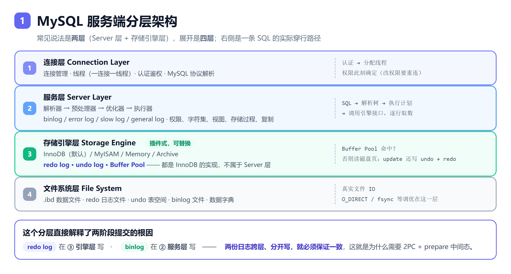

# 2026.09.11 影石面经八股（MySQL / Redis / MQ）

> 来源：影石 Insta360 后端面经题单整理 + 逐题深挖。配图在 `assets/`，由 `assets/src/render.sh` 生成。

---

# 一、MySQL

## 0. 服务端分层架构（先把地图看清）

**常见说法是"两层"，展开是"四层"**：

- **两层**：Server 层 + 存储引擎层（这是 MySQL 最核心的设计——引擎插件化）
- **四层**：连接层 → 服务层 → 存储引擎层 → 文件系统层



| 层 | 内容 | 要点 |
|---|---|---|
| **① 连接层** | 连接管理、线程（一连接一线程）、认证鉴权、协议解析 | 认证通过后**权限就定下来了，改权限要重连才生效**；空闲连接超时 `wait_timeout`（默认 8h）；长连接的临时内存累积可用 `mysql_reset_connection` 重置 |
| **② 服务层** | 解析器 → 预处理器 → 优化器 → 执行器；binlog / error log / slow log / general log；权限、字符集、视图、存储过程、复制 | `explain` 是**优化器**的产物；查询缓存也在这层（8.0 已移除，因 key 是 SQL 原文、命中率低、表一改全失效） |
| **③ 存储引擎层** | InnoDB（默认）/ MyISAM / Memory / Archive；**redo log、undo log、Buffer Pool** | 插件式，向上提供统一 handler API。**同一张表换引擎，Server 层 SQL 逻辑不变，但锁、事务、索引实现全变** |
| **④ 文件系统层** | `.ibd`、redo 日志文件、undo 表空间、binlog 文件、数据字典 | 真实文件 IO，`O_DIRECT` / `fsync` 等调优在这层 |

### SQL 的穿行路径

```
① 连接层：认证 → 分配线程
② 服务层：解析器（SQL→解析树）→ 预处理器（权限/语义）→ 优化器（选索引、定 join 顺序）
          → 执行器（按计划调用引擎接口，逐行取数）
③ 引擎层：查 Buffer Pool 命中？否则读磁盘页；update 还要写 undo + redo
④ 文件系统层：真实文件 IO
```

### 别把"逻辑归属"和"物理文件"搞混

`redo log` / `undo log` / `binlog` 经常被放错层，因为它们是同一东西的两个视角：

| 东西 | 逻辑归属（谁负责） | 物理落在哪 |
|---|---|---|
| 连接、线程、认证 | ① 连接层 | — |
| 解析器 / 优化器 / 执行器 | ② 服务层 | — |
| **binlog**（生成、格式、写入时机） | ② 服务层 | 文件 → ④ |
| InnoDB / MyISAM 实现 | ③ 引擎层 | — |
| **redo log**（buffer、checkpoint、fsync 时机） | ③ 引擎层 | 文件 → ④（`ib_logfile*`） |
| **undo log**（版本链、回滚） | ③ 引擎层 | 表空间 → ④（undo tablespace） |
| **Buffer Pool** | ③ 引擎层 | **内存**，不落盘（缓存的是 ④ 的页） |
| `.ibd` / 数据字典 / 各日志文件 | — | ④ 文件系统层 |

**规则：每层管"逻辑职责"，文件系统层是所有层共用的"落盘端点"，不是某层专属。**

这个区分在排障时有用：逻辑职责出问题（binlog 没记、checkpoint 不推进、锁行为不对）→ 查 ②/③ 的机制和配置；文件层出问题（磁盘满、IO 慢、fsync 抖动）→ 查 ④，`iostat` / `O_DIRECT` / 挂载参数才管用。

**层数本身不是考点，"归属物放对"才是。** 答"两层（Server + 引擎），展开成四层"然后准确归位，比纠结层数有价值。


**关键认知**：执行器拿到的只是引擎返回的**原始行**，过滤/排序/聚合很多在 Server 层做——所以 `rows_examined` 远大于返回行数。**索引下推（ICP）**就是把能下推的过滤条件交给引擎层，减少回表。

### 这个分层为什么重要

它直接解释了两阶段提交的根因：

```
redo log 在 ③ 引擎层 写
binlog   在 ② 服务层 写
         ↑ 两份日志跨层、分开写 → 必须保证一致 → 这就是 2PC 存在的理由
```

三个常见追问：

- **"查询缓存在哪层？"** 服务层，8.0 已移除。
- **"为什么 8.0 没有 .frm 文件了？"** 数据字典统一收到 InnoDB 的系统表（事务性数据字典），不再每表一个 `.frm`。
- **"慢 SQL 怎么定位到哪一层？"** `explain` 是优化器的产物（看执行计划选错没）；`Handler_read_*` 状态变量是引擎层的真实取数（看实际 IO 多不多）。两者对照才能分清是选错索引还是数据量本来就大。

## 1. B 树 vs B+ 树，为什么用 B+ 树

- **B 树**：key 和 data 存在所有节点上，数据分散在各层。
- **B+ 树**：只有叶子节点存数据，非叶子节点只存 key 做索引；叶子之间用**双向链表**串起来。

选 B+ 树的三个理由：

1. **树更矮 → IO 更少**：非叶子节点不存数据，一个 16KB 页能塞上千个 key（bigint + 页号约 14B），扇出大、层数少。
2. **查询性能稳定**：数据全在叶子层，任何查询路径等长；B 树可能在非叶子就命中，快慢不一。
3. **范围查询友好**：顺着叶子链表扫即可；B 树要中序遍历、来回回溯父节点。

对比其他结构：红黑树是二叉树，千万级数据高度约 24 层，磁盘 IO 太多；哈希等值查询 O(1) 但不支持范围和排序。

## 2. B+ 树一个 page 多大

- InnoDB 默认 **16KB**（`innodb_page_size`，可配 4/8/16/32/64KB），一次磁盘 IO 读一个页。
- 非叶子节点约 `16KB ÷ 14B ≈ 1000+` 个 key；叶子节点按一行 1KB 算放 16 行。
- 三层：`1000 × 1000 × 16 ≈ 1600 万行`。**根节点常驻内存，实际只要 2 次磁盘 IO**。

## 3. 聚簇索引与回表

- **聚簇索引**：索引和行数据在一起，叶子节点就是整行。InnoDB 主键索引即聚簇索引，**一张表只有一个**。
- **二级索引**：叶子节点存**主键值**。查到主键后回聚簇索引捞整行 → **回表**。
- **覆盖索引**：要的列都在二级索引里 → 不回表（Extra 显示 `Using index`）。
- 两个推论：**为什么用自增主键**（顺序插入避免页分裂；主键越长二级索引越大）、**为什么别用 UUID**（随机插入频繁页分裂 + 碎片）。

## 4. 索引失效场景

**先立框架**：不是"7 个场景"的清单，而是**两类完全不同的原因**——

```
第一类：语法/语义上索引【根本用不了】 → 改 SQL 就能解决，确定性
第二类：索引能用，但优化器【主动放弃】 → 靠统计信息和索引设计解决
```

### 第一类：索引根本用不了

**① 索引列上做运算**

```sql
WHERE id + 1 = 10        -- ❌ 失效（索引存的是原值，B+ 树没法按表达式定位）
WHERE id = 10 - 1        -- ✅ 运算挪到常量侧
```

**② 索引列上套函数**

```sql
WHERE DATE(create_time) = '2024-01-01'                            -- ❌
WHERE create_time >= '2024-01-01' AND create_time < '2024-01-02'  -- ✅ 改范围
```

**8.0 加分点**：可建**函数索引**让这种情况也走索引 —— `ALTER TABLE t ADD INDEX idx_d ((DATE(create_time)));`（8.0.13+）

**③ 隐式类型转换**（最易踩、最爱考）

规则：**MySQL 比较时把字符串转成数字**，而不是把数字转成字符串。方向决定成败：

```sql
-- phone 是 varchar(11)
WHERE phone = 13800000000     -- ❌ 列被转成数字 → 失效
WHERE phone = '13800000000'   -- ✅
-- id 是 int
WHERE id = '123'              -- ✅ 常量被转成数字 → 有效
```

**更狠的是它还会查错**：字符串转数字时非数字开头结果是 0 ——
`WHERE name = 0`（name 是 varchar，表里有 `'abc'`）会**匹配到 `'abc'`**，因为 `CAST('abc' AS SIGNED) = 0`。

**④ 前导模糊匹配**

```sql
WHERE name LIKE '%abc'    -- ❌
WHERE name LIKE '%abc%'   -- ❌
WHERE name LIKE 'abc%'    -- ✅ 索引按前缀有序
```

要后缀/中间匹配：倒排索引（ES），或存反转字符串再 `LIKE 'cba%'`。

**⑤ OR 连了非索引列**

```sql
WHERE a = 1 OR b = 2      -- b 无索引 → 整体全表扫
WHERE a = 1 OR a = 2      -- ✅ 同一列，本质是 range
```

**例外**：OR 两侧**都有索引**时可用**索引合并** → Extra 显示 `Using union(idx_a, idx_b)`。

**⑥ 不满足最左前缀 + 范围查询中断后续列**

```sql
INDEX (a, b, c)
WHERE b = 1                      -- ❌ 完全用不上
WHERE a = 1 AND c = 2            -- ⚠️ 只用到 a（跳过 b 就断了）
WHERE a = 1 AND b > 2 AND c = 3  -- ⚠️ a、b 走索引，c 用不上
```

最后一条直接推出**联合索引列序设计原则**：**等值查询的列放前面，范围查询的列放最后**。

### 第二类：优化器主动放弃

"昨天走索引今天不走了"的答案就在这类：

| 场景 | 原因 |
|---|---|
| **选择性太低** | `status` 只有 0/1 且 99% 是 1 → 估算要回表 99% 的行，不如全表扫 |
| **统计信息过期** | `EXPLAIN` 的 `rows` 失真 → `ANALYZE TABLE` |
| **表太小** | 几百行，全表扫比"走索引 + 回表"更快 |
| **`!=` / `not in` / `is not null`** | 不是语法失效，是**回表行数估算太大**时主动放弃 |
| **`IN` 值太多**（几百上千） | 优化器可能改全表扫 |

**判断方法**：`explain` 里 **`possible_keys` 有值但 `key` 是 NULL** → 索引可用，是优化器算完觉得不划算。

### 三个最容易答混的点

1. **`IS NULL` 能走索引，`IS NOT NULL` 往往不能**，但原因不同：前者 InnoDB 索引里 NULL 是特殊第一项、可精确定位；后者**不是语法失效**，是优化器估算回表行太多而放弃。
2. **`SELECT *` 不是索引失效** —— 它只是让**覆盖索引**优势消失、必须回表。"用不上索引"和"用了索引还得回表"是两件事。
3. **`type = index` 不等于走索引有效** —— 那是**全索引扫描**（扫完整棵索引树），比全表扫好一点但同样 O(n)。真正有效的是 `ref` / `range` / `const`。

### 排查：explain 看四列

```
key = NULL                     → 第一类原因，去看 SQL 写法
possible_keys 有 / key = NULL   → 第二类原因，优化器主动放弃
type = ALL / index             → 全表扫 / 全索引扫，都要警惕
key_len                        → 用了联合索引的几列（能看出最左前缀用了几段）
Extra: Using where             → 还要在 Server 层过滤
       Using filesort/temporary → 额外排序 / 临时表
rows 估算失真                   → ANALYZE TABLE
```

### 口诀

```
列上不做运算和函数（要算就挪到常量侧，或建函数索引）
类型必须对得上（varchar 传字符串，别传数字）
前缀匹配才有效（LIKE 'abc%'）
联合索引守最左（不跳列，范围列放最后）
OR 两侧都要有索引（否则改 UNION）
统计信息勤更新（ANALYZE TABLE）
```

**面试话术**："我习惯分两类看。**第一类语法上根本用不了**：列上做函数或运算、隐式类型转换、前导模糊、不满足最左前缀、范围查询中断后续列——改 SQL 就能解决，是确定性的。**第二类有索引但优化器主动放弃**：选择性太低、回表行数太多、统计信息过期、表太小，典型特征是 explain 里 possible_keys 有值但 key 为 NULL。排查就是 explain 看四列：key 是否 NULL、type 是否 ALL/index、key_len 用了几列、Extra 有没有 filesort；第二类先 ANALYZE TABLE，还不行就调索引设计。"

## 5. 最左前缀

联合索引 `(a,b,c)` 按 a→b→c 排序，于是：

| 条件 | 用上的列 | 说明 |
|---|---|---|
| `a` / `a b` / `a b c` | 全部 | 左前缀连续 ✅ |
| `a c` | 只有 a | **跳过 b 就断了** |
| `a = 1 and b > 2 and c = 3` | a、b | **b 是范围查询，破坏 c 的有序性** |

设计结论：**等值查询的列放前面，范围查询的列放最后**；中间不能跳列。8.0 有"索引跳跃扫描"兜底但别依赖。

## 6. explain 定位慢 SQL

先用慢查询日志（`slow_query_log` + `long_query_time`）或 `pt-query-digest` 找出目标 SQL，再 explain。看四列：

- **type**：`system > const > eq_ref > ref > range > index > ALL`，出现 **`ALL` / `index`** 要警惕。
- **key** vs **possible_keys**：能看出"有索引但没用上"。
- **rows**：预估扫描行数。
- **Extra**：`Using index`（覆盖索引，好）、`Using filesort`（额外排序，慢）、`Using temporary`（临时表，慢）、`Using index condition`（索引下推 ICP）。

8.0.18+ 用 **`explain analyze`** 看真实执行时间，比预估的 `rows` 靠谱。

## 7. 隔离级别与幻读

| 级别 | 脏读 | 不可重复读 | 幻读 |
|---|---|---|---|
| 读未提交 RU | ✗ | ✗ | ✗ |
| 读已提交 RC | ✅ | ✗ | ✗ |
| **可重复读 RR（默认）** | ✅ | ✅ | ✅ |
| 串行化 | ✅ | ✅ | ✅ |

三种问题：**脏读**读到别的事务未提交的数据；**不可重复读**同一行的值变了；**幻读**范围查询的行数变了。

### MySQL 的 RR 靠什么防幻读——两条路各管一半

- **快照读**（普通 `select`）→ **MVCC**，整个事务读同一份快照，别人插的行看不见。
- **当前读**（`for update` / `update` / `delete`）→ **临键锁/间隙锁**，物理上挡住插入。

### 但 MVCC 单独防不住幻读（重要）

经典例子：

| 时刻 | 事务 A | 事务 B |
|---|---|---|
| T1 | `begin;` | |
| T2 | `select * from t where d = 5;` → 返回**空**（快照定格） | |
| T3 | | `begin; insert into t values(5,5,5); commit;` |
| T4 | `update t set d = 100 where d = 5;` → **影响 1 行** ⚠️ | |
| T5 | `select * from t where d = 5;` → 空 | |
| T6 | `select * from t where d = 100;` → **返回 B 插入的那行！** | |

根因：T4 的 update 是**当前读**，看到了 B 新插的行并改了它，这行的 `DB_TRX_ID` 变成 A；而 MVCC 规则里"**事务能看见自己的修改**"，于是这行就出现在 A 的快照读里了。

**结论**：MySQL 的 RR **没有完全解决幻读**——纯快照读靠 MVCC、纯当前读靠间隙锁，但两者混用时仍会幻读。要彻底防住得上 Serializable。

## 8. MVCC

三个部件：

1. **隐藏列**：每行有 `DB_TRX_ID`（最近改这行的事务 ID）和 `DB_ROLL_PTR`（指向 undo 的回滚指针）。
2. **undo log 版本链**：每次修改留一份旧版本，靠 `DB_ROLL_PTR` 串成链。
3. **Read View**：快照读时生成，含 `m_ids`（活跃未提交事务 ID 列表）、`min_trx_id`、`max_trx_id`、`creator_trx_id`。

可见性判断（沿版本链从新往旧找）：

```
trx_id <  min_trx_id  → 已提交，可见 ✅
trx_id >= max_trx_id  → 事务还没开始，不可见
trx_id 在 m_ids 里     → 当时还活着，不可见
```

**RC 与 RR 的差别只有一句：Read View 什么时候生成。**

| | Read View 生成时机 | 结果 |
|---|---|---|
| **RC** | **每次** select 都重新生成 | 能看到新提交的数据 → 不可重复读 |
| **RR** | 只在**第一次** select 时生成，之后复用 | 整个事务看同一份快照 |

## 9. undo / redo / binlog 三兄弟

**先说清定位**：三者的差异远不止"留存时长"，核心是**归属层 + 日志类型 + 用途**三条。

| | undo log | redo log | binlog |
|---|---|---|---|
| 归属 | InnoDB | InnoDB | **Server 层**（所有引擎共用） |
| 类型 | 逻辑日志（反向操作） | **物理日志**（页的字节修改） | **逻辑日志**（行变更 / SQL） |
| 用途 | **回滚 + MVCC 版本链** | **崩溃恢复**（持久性 D） | **主从复制、备份恢复** |
| 写入时机 | 修改前写 | 事务**执行过程中**就写 | 事务**提交时**才写 |
| 内容 | 旧版本 | **含未提交事务**的修改 | 只含**已提交**的事务 |
| 写法 | 随机 | **循环写**（固定大小，write pos 追 checkpoint） | **追加写**（写满切文件） |
| 可读性 | 内部格式 | 内部格式，不对外保证兼容 | 格式稳定，`mysqlbinlog` 可解析；STATEMENT/ROW/MIXED |
| 能否关闭 | 不能 | **不能**（InnoDB 必需） | 可以（`skip-log-bin`） |

- **WAL**：先写 redo、再择机刷数据页，所以提交快、崩了能重放。
- **undo 分两种**：insert undo（回滚后即可删）、update undo（MVCC 还要用，不能马上删）。
- **"时长不同"只是循环写 vs 追加写这个结果，不是根因。**

### 三个"只差时长说不通"的地方

1. **层级不同，影响面不同**：redo 是 InnoDB 私有实现；binlog 在 Server 层，**MyISAM 等引擎也有 binlog 没有 redo**——复制是实例级别的事，不能绑到某个引擎。
2. **类型不同决定用途不可互换**：
   - binlog 不能替代 redo 做崩溃恢复——逻辑日志没法直接重放到数据页；
   - redo 不能替代 binlog——循环写会被覆盖、历史留不住、格式不兼容、没有 GTID/位点语义。
3. **内容范围不同**（最容易被深挖）：事务 T 执行了 UPDATE 但还没 COMMIT 就崩了 ——

   ```
   redo 里：有 T 的修改，但只有 prepare 标记、无 commit 标记 → 恢复时回滚
   binlog 里：压根没有 T（还没走到 commit 阶段）
   从库：永远看不到这个未提交的事务
   ```

   **redo 有记录 ≠ 事务已提交**，这正是 prepare/commit 标记存在的意义。

### binlog 是"操作日志"吗

**不严谨**。准确说是**逻辑日志 + 归档日志**，而且**只记变更（DML + DDL），不记 SELECT**。

| 日志 | 记什么 | 用途 |
|---|---|---|
| **general query log** | **所有语句，含 SELECT** ← 这个才是"全量操作日志" | 调试（生产一般关） |
| **slow query log** | 超过 `long_query_time` 的语句 | 慢 SQL 定位 |
| **error log** | 启动、关闭、错误 | 故障排查 |
| **binlog** | **只有变更** | 复制、恢复 |
| **relay log** | 从库拉主库 binlog 的中转 | 从库重放 |

追问"能用 binlog 做审计吗"：**有限，不推荐**——不记 SELECT、没有用户/IP/客户端维度、会被清理（`binlog_expire_logs_seconds`）、可以被临时关闭。审计要用 Audit Plugin 那类专门的审计日志。


## 10. 两阶段提交（redo 与 binlog 的一致性）

问题：一个事务要写两种日志（redo 在 InnoDB 层、binlog 在 Server 层），分开写中间崩了就主从不一致。

### 写入时序


```
① Prepare 阶段：redo prepare → fsync 落盘          ← 崩溃点 A
② Commit 阶段 a：binlog → fsync 落盘（带 XID）      ← 崩溃点 B
② Commit 阶段 b：redo 写 commit 标记（不必立刻 fsync）← 崩溃点 C
```

**顺序不能换**：先 redo prepare → 再 binlog → 最后 redo commit。因为判据（binlog）必须先于最终结论落盘。

### 崩溃恢复的判定规则


```
redo 里是 commit 标记  → 直接提交（不看 binlog）
redo 里是 prepare 标记 → 看 binlog 是否完整：
                          完整   → 提交
                          不完整 → 回滚
```

- **binlog 完整性怎么判**：每个事务末尾有 **`XID_EVENT`**，恢复时拿 redo prepare 里的 XID 去 binlog 找对应的 XID event；找到即完整。另有 `binlog_checksum=CRC32` 校验文件。
- **为什么最后一步不用 fsync**：prepare 已落盘 + binlog 已完整落盘，崩在这里照样判提交。**用 binlog 的完整性替代了对 commit 标记落盘的依赖**——这是设计的精髓，也省下一次 fsync。

### 为什么必须有 prepare 中间态

- 只写 redo → 从库和备份链断了；只写 binlog → 主库数据丢（binlog 是逻辑日志，无法用于 InnoDB 的页级恢复）。
- 两份都要写 ⟹ 必然需要"**一个悬而未决的中间态 + 一个判据**"：prepare 是前者，binlog 完整性是后者。

### 组提交（group commit）

按上面时序一个事务要 2~3 次 fsync，高并发下 fsync 是纯瓶颈。5.7 起把三阶段都做成组提交，一次 fsync 带一批：

```
Flush 阶段：各事务 binlog cache 写文件（不 fsync），【串行排序】保证顺序一致
Sync 阶段： fsync binlog —— 一组一起刷，只有一个"领导者"去做
Commit 阶段：按顺序写 redo commit，释放事务
```

调优参数：`binlog_group_commit_sync_delay`（延迟微秒数，攒更多事务，用延迟换吞吐）、`binlog_group_commit_sync_no_delay_count`（攒够多少立即刷）。

**双 1 配置**：`sync_binlog=1` + `innodb_flush_log_at_trx_commit=1` → 保证不丢一个事务，代价是每事务至少两次 fsync。

### 与分布式 2PC 的区别（别混）

| | MySQL 内部 2PC | 分布式 2PC（XA） | TiDB Percolator |
|---|---|---|---|
| 参与者 | redo / binlog 模块（**同进程**） | 多个数据库资源 | 多个 TiKV region |
| 协调者 | **引擎内部**（binlog 扮演） | **外部 TM** | **无中心者**，primary key 仲裁 |
| 解决 | 单机两份日志一致 | 跨节点原子提交 | 快照隔离 + 线性一致 |
| 时间戳 | 无 | 无 | **TSO**（PD 分配） |
| 恢复 | binlog 完整性 | TM 日志 | 有锁就问 primary |

**Percolator 要点**：Client 从 PD 拿 `start_ts` → Prewrite 写锁+数据（第一个 key 当 **primary**）→ 拿 `commit_ts` → 先提交 primary（**primary 成功 = 整个事务必成功**）→ 异步提交 secondary。恢复时遇到锁就去问 primary 的状态。用 primary key 当仲裁点，**去掉了中心协调者**。

**2PC 与 Raft 不是竞争关系**：2PC 管"多个分片怎么原子提交"（事务协议），Raft 管"同一份数据多副本怎么一致"（复制协议）。TiDB = 上层 Percolator 2PC + 下层 Raft 复制。

## 11. 间隙锁加锁过程（UID 3,5,7 例题）

题：索引里只有 3、5、7，RR 下执行 `update ... where uid > 3 and uid < 5`，加什么锁？

**答案：间隙锁 `(3,5)`**，不锁 uid=7，也不锁 uid=5 这一行。

### 三种行锁

```
临键锁 Next-Key Lock = 间隙锁 Gap Lock + 记录锁 Record Lock
          (3, 5]     =   (3, 5)      +      [5, 5]
```

| 模式 | 区间 | 左端 prev | 右端 self |
|---|---|---|---|
| **临键锁** | `(prev, self]` | 开（不含） | 闭（**含**） |
| **记录锁** | `[self, self]` | —（间隙去掉） | 闭（含） |
| **间隙锁** | `(prev, self)` | 开（不含） | 开（**也不含**） |

**关键：锁永远以自己为右端点、回头看左边那段空隙，从不越界去碰前一条记录。** 相邻记录的临键锁首尾相接、不重不漏：

```
记录3 的临键锁：(-∞, 3]
记录5 的临键锁：(3, 5]
记录7 的临键锁：(5, 7]
supremum 伪记录：(7, +∞]
```

### 加锁过程的伪代码

```
用 WHERE 条件定位索引游标（决定起点）
loop:
    读下一条索引记录 R
    if R 满足 WHERE:
        加临键锁 = 间隙(上一条, R) + 记录[R]     # 命中的记录
        continue
    else:                     # R 是第一条不满足条件的记录 = 扫描终点
        加间隙锁(上一条, R)    # 只锁间隙，R 自己不加锁
        break
# 终点之后的记录：从未被读入 → 什么都不加
```

### 套到本题

```
索引：   -∞      [3]       [5]       [7]      +∞
                   │         │
              （3 不被访问）   │
                    └─────────┤
                       间隙锁 (3,5)          ← 答案

记录 3：uid > 3 ✗ → 不在加锁流程里
记录 5：满足 >3 但不满足 <5 → 第一条不满足条件的记录
        → 本应是临键锁 (3,5]，但记录不满足条件 → 行锁部分退掉 → 只留间隙锁 (3,5)
记录 7：扫描已终止，从未被访问 → 不加锁
```

外加固定的表级**意向写锁 IX**。

### 可观测效果

| 另一事务的操作 | 结果 | 原因 |
|---|---|---|
| `insert uid = 4` | **阻塞** | 插入意向锁 vs 间隙锁 (3,5) |
| `insert uid = 2` / `6` | 通过 | 落在没锁的间隙 |
| `update uid = 5` 那行 | 通过 | 行锁没加 |
| 再跑同样的 update | 通过 | **间隙锁之间兼容**，只跟插入意向锁冲突 |

### 三条决定加锁结果的要素

```
① WHERE 条件      → 扫描路径（起点、终点各在哪条记录）
② 逐条判断"是否满足 WHERE"
     满足   → 临键锁（间隙 + 自己）
     不满足 → 只留间隙锁（仅扫描终点那一条）
③ 索引里的邻居记录 → 决定间隙的实际左右端点
④ 边界之后没被扫到 → 不加锁
```

**一句话：条件是"路线"，命中是"模式"，数据是"边界"。**

### 数据一变答案就变（这才是真考点）

| 索引数据 | 条件 | 加什么锁 |
|---|---|---|
| 3, 5, 7 | `>3 and <5` | 间隙锁 `(3,5)` |
| 3, 5, 7 | `>=3 and <5` | 临键锁 `(-∞,3]` + 间隙锁 `(3,5)` |
| 3, 4, 5 | `>3 and <5` | 临键锁 `(3,4]` + 间隙锁 `(4,5)` |
| 3, 4, 5 | `>=3 and <5` | 临键锁 `(-∞,3]` + `(3,4]` + 间隙锁 `(4,5)` |
| 3, 5, 7 | `uid = 5`（唯一索引命中） | 记录锁 `[5,5]` |
| 3, 5, 7 | `uid = 4`（值不存在） | 间隙锁 `(3,5)` |

### 前提与例外

- **只在 RR 下成立**。RC 下 InnoDB 会**跳过间隙锁**（`trx->skip_gap_locks()` 在 RC/RU 下返回 true）→ 加的是记录锁 → 防不住幻读，但并发高、死锁少。RC 还有**半一致性读**：UPDATE 时读到不匹配的行就放锁。
- **RC 也并非零间隙锁**：**唯一性冲突检查**和**外键约束检查**仍会用临键锁。
- **没索引时是灾难**：where 用不上索引 → 全表扫描 → 对扫过的每条记录加临键锁，效果接近锁表。

## 12. CDC 读的是 binlog

**必须开 `binlog_format = ROW`**，因为 CDC 需要变更的**前镜像/后镜像**；STATEMENT 只有 SQL 原文，`update t set x = x + 1` 根本还原不出具体值。

**为什么不是 redo**：redo 是**物理日志**（页级字节修改），没有行级语义；而且是**循环写**、会被覆盖，历史留不住；格式也不对外保证兼容。binlog 是逻辑日志、持久追加、格式稳定，还有 file+position / GTID 的位点语义。

**工作原理**：CDC 工具**伪装成 MySQL 的从库**，向主库发 `COM_BINLOG_DUMP`，主库的 dump 线程推送 binlog 事件流（就是主从复制那套协议）→ 账号需要 `REPLICATION SLAVE` 权限。

细节：

- **三种行事件**：`WRITE_ROWS_EVENT`（insert，只有后镜像）、`UPDATE_ROWS_EVENT`（前后镜像都有）、`DELETE_ROWS_EVENT`（delete，只有前镜像）。
- **`binlog_row_image`**：默认 `FULL`（前后镜像含所有列）；设成 `MINIMAL` 时前镜像只有主键、后镜像只有被改列——下游要还原完整行得自己关联，常见坑。
- **位点**：file+position 或 GTID（推荐，主从切换不错位）。
- **DDL 是 Query event**（不是行事件），要单独处理。
- **异步消费**，天然有延迟。

常用工具：**Canal**（阿里）、**Debezium**（Flink CDC 底层也用它）、**Maxwell**。

追问"为什么不用触发器"：触发器拖慢主库写入、难以捕获删除前数据、容易被绕过；binlog 对主库几乎零侵入且能拿到完整前后镜像。

---

# 二、Redis

## 13. 数据类型与底层

| 类型 | 底层结构 | 典型场景 |
|---|---|---|
| String | **SDS**（带 len/free，二进制安全） | 缓存、计数、分布式锁 |
| List | **quicklist**（ziplist 组成的双向链表） | 消息队列、最新列表 |
| Hash | ziplist（小）/ hashtable（大） | 存对象 |
| Set | intset（纯整数）/ hashtable | 去重、共同好友 |
| ZSet | **skiplist + dict** | **排行榜**、延时队列 |
| Bitmap | 基于 String 的位操作 | 签到、UV、布隆过滤器 |

ZSet 用两个结构配合是关键：**dict 负责 O(1) 按成员查分数，skiplist 负责按分数范围查询**。

SDS 相比 C 字符串三个改进：O(1) 取长度、二进制安全（不靠 `\0` 判结尾）、预分配减少扩容。

## 14. 分布式锁与锁续期

```bash
SET lock_key unique_value NX PX 30000   # 原子：不存在才设置 + 30s 过期
```

- 解锁必须用 **Lua 脚本**保证"判断 value 是不是自己的"+"删除"原子，否则可能删掉别人的锁。
- **锁续期解决什么**：业务执行超过 TTL，锁自动释放被别人拿到 → 两个客户端同时执行。本质是"锁有效期"和"业务时长"竞赛。
- **方案：看门狗（watchdog）**。Redisson 加锁成功后注册后台任务，每 `TTL/3`（默认 10s）检查一次，仍持有就续期回 30s，直到显式释放。
- **怎么判断业务线程还在执行**：Redisson 的锁对象带**重入计数**，计数器 > 0 就续期；释放时递减，减到 0 才真正释放、停掉看门狗。
- **Redlock 的争议**：多节点投票（N 个独立 Redis 过半成功）理论上防单点，但 Kleppmann 指出在**时钟漂移和 GC 停顿**下不安全。实践中更常见"单实例 + 看门狗 + 哨兵/集群高可用"。

## 15. 哨兵 vs 集群

| | 哨兵 Sentinel | 集群 Cluster |
|---|---|---|
| 解决什么 | **高可用**（自动故障转移） | **容量扩展**（分片）+ 高可用 |
| 数据 | 主从复制，**一份全量** | 分片，**16384 个 slot** 分布多节点 |
| 上限 | 受单机内存限制 | 可水平扩展 |
| 机制 | 主观下线 → 客观下线（超 quorum）→ 哨兵选举 leader → 选新主 | key 经 CRC16 算 slot 路由，`MOVED`/`ASK` 重定向 |
| 限制 | 容量上不去 | 多 key 操作要同 slot（`{hash tag}`）、不支持多库 |

一句话：**哨兵是"高可用方案"，集群是"分片 + 高可用方案"。**

## 16. 缓存穿透 / 击穿 / 雪崩

| | 是什么 | 方案 |
|---|---|---|
| **穿透** | 查的数据**根本不存在**，缓存和 DB 都没有，每次都打 DB | ① 缓存空值（短过期）② **布隆过滤器**前置拦截 ③ 参数校验 |
| **击穿** | **单个热点 key 过期**的瞬间，大量并发同时打 DB | ① 分布式锁/互斥，只放一个请求查 DB ② 热点 key 不过期 ③ 逻辑过期 + 异步更新 |
| **雪崩** | **大批 key 同时过期**，或 Redis 整体宕机 | ① 过期时间加**随机值**打散 ② 多级缓存 ③ 限流降级熔断 ④ 集群高可用 |

记忆抓手：**穿透 = 数据不存在；击穿 = 热点那一个失效；雪崩 = 一大批同时失效。**

## 17. bitmap 底层

- **不是独立数据类型**，而是**基于 String 的位操作**——底层就是 SDS 的字节数组，`SETBIT` 直接改某个 bit。
- 上限：String 最大 512MB → 能表示 **2³² ≈ 42.9 亿**个位。
- 命令：`SETBIT` / `GETBIT` / `BITCOUNT` / `BITOP` / `BITPOS`。
- 空间：**1 亿用户签到只用 12.5MB**（10⁸ bit ÷ 8 ÷ 1024²）。
- 注意：`SETBIT` 的 offset 很大会触发自动扩容（内存可能突增）；`BITCOUNT` 是 O(N) 但 N 是**字节数**。

## 18. 布隆过滤器

- 结构：**一个位数组 + k 个哈希函数**。
- **添加**：key 经 k 个哈希算得 k 个位置，全置 1。
- **查询**：k 个位置**全是 1** → 可能存在；**任意一个是 0** → **一定不存在**。
- **核心特性：只有假阳性，没有假阴性**。说"不存在"绝对可靠，说"存在"可能误判——因为添加时所有位都置 1 了，只要不删，查询必然全为 1。
- 误判率 `p ≈ (1 - e^(-kn/m))^k`（m 位数组大小、n 元素个数、k 哈希个数），**k 取 `(m/n)·ln2` 最优**。
- **不支持删除**（某位为 1 无法判断是谁置的）→ 要删用 **Counting Bloom Filter**（位换计数器）。
- 用途：**缓存穿透防护**、爬虫 URL 去重、Redis 的 `BF.ADD`（RedisBloom 模块）。

---

# 三、MQ

## 19. RabbitMQ：丢失、重复、幂等、积压

### 丢失的三个环节，逐段防

| 环节 | 为什么会丢 | 方案 |
|---|---|---|
| 生产者 → Broker | 网络问题没送到 | **publisher confirm**（异步确认）+ return 回调 + 本地消息表兜底 |
| Broker 内部 | 消息在内存没落盘，Broker 挂了 | **队列持久化 + 消息持久化**（`delivery_mode=2`）+ 镜像队列/quorum queue |
| Broker → 消费者 | 消费者处理到一半挂了 | **手动 ack**，成功才 ack；失败 nack 重入队或进**死信队列** |

### 重复消费 → 幂等

根因：ack 丢了导致重投、或消费失败重试。三种手段：

1. 业务唯一 ID / messageId 建**去重表**（数据库唯一索引，重复插入直接冲突）
2. Redis `SETNX` 记录已消费 ID
3. **状态机**：只允许特定状态流转，重复消息因状态不符被忽略

### 积压

原因：消费慢、消费者挂了、突发流量。方案：

1. 扩消费者（会破坏顺序性）
2. 消费者**批量拉取 + 批量处理**
3. 临时起消费者把消息快速转到新队列，慢慢消化
4. 优化消费逻辑（异步化、减少 DB 往返）
5. 生产端限流，先止血

### 顺带：顺序性

只有"**一个队列 + 一个消费者**"才能保证顺序；多消费者必然乱序。要保序就用单队列单消费者，或用一致性哈希把同一业务 key 路由到同一队列。

## 20. Seata AT 模式

**角色**：TC（独立的 Seata Server，全局事务协调者）、TM（发起方，`@GlobalTransactional`）、RM（各微服务的数据库）。

**两阶段**：

```
一阶段：各分支执行本地事务 → 【直接提交】（不等别人）
        同时代理数据源拦截 SQL，生成 before/after 镜像写入 undo_log
        注册分支到 TC，申请全局锁
二阶段：
  全部成功 → TC 通知各分支【异步删除 undo_log】（快，几乎无开销）
  有失败   → 用 undo_log + before image 做【反向补偿】还原数据
```

**三个关键点**：

1. **一阶段就提交本地事务**——不像 XA 长时间持有数据库锁，性能好得多；代价是回滚只能靠**补偿**。
2. **需要全局锁**：一阶段已提交，补偿前不能让别人改这些行，否则 before image 还原会覆盖别人的修改。
3. **默认隔离级别是读未提交**——一阶段已提交，别人能看到"全局事务未结束但数据已改"的中间态。这是 AT 的软肋；要读已提交得靠 `@GlobalLock` 或 `select ... for update` 兜。

**与 XA 对比**：XA 一阶段 prepare 不提交、锁持有到二阶段，锁重但隔离性好；AT 一阶段直接提交、靠 undo_log 补偿回滚，性能好但要自己防脏读。

## 21. Kafka 的四个「位置」：LEO/HW 与 position/committed offset

> 混的根源：**两个都叫 commit，含义完全不同**——副本层面 commit 的是「消息」，消费层面 commit 的是「位移」。

| | 副本层面的 commit | 消费层面的 commit |
|---|---|---|
| 什么被"提交" | 消息 | 位移 |
| 判据 | 所有 ISR 复制完 → 越过 HW | 写进 `__consumer_offsets` |
| 谁做 | leader（推进 HW） | consumer（发 OffsetCommit 请求） |
| 怎么读 | 消费者只能读到 HW 之前 | consumer 自己记着 committed offset |

### 第一对：LEO / HW（broker 真正的那两个，副本维度）

```
                     ┌───────── partition 日志 ─────────┐
  ... msg@96 │ msg@97 │ msg@98 │ msg@99 │ msg@100 │ (空)
                     ▲                 ▲          ▲
                    HW=98             │        LEO=101
              （所有 ISR 都复制到的位置）        （下一条要写的位置）
                                      │
                        消费者只能读到 HW 之前
                        → msg@98 及之后对消费者【不可见】
```

| | 含义 | 谁能读到 |
|---|---|---|
| **LEO** | 日志末端 = 最后一条 offset + 1。**每个副本各有一份** | 只有 broker 内部（副本同步用） |
| **HW** | **所有 ISR 副本都已复制到**的位置 | **消费者读的上界** |

机制：

```
① Leader 收到消息写入自己的日志 → Leader LEO 前进
② Follower 主动来拉（pull）→ 拉到后写自己的日志 → Follower LEO 前进
③ Leader 更新 HW = min(所有 ISR 副本的 LEO)
④ Leader 在【下一次】拉取响应里把 HW 告诉 follower → follower 更新自己的 HW
```

**注意 follower 的 HW 更新总比 leader 慢一轮**（HW 要"喂"下一次 fetch 响应才能带过去）——这是很多一致性讨论的出发点。

**为什么消费者只能读到 HW？** 因为 HW 之前的数据才保证"即使 leader 挂了、从 ISR 选新主也不丢"。允许读 HW 之后就会读到可能被截断的数据。代价是端到端延迟（写入到可消费之间隔一次副本同步）。

**HW 回退的唯一例外**：正常从 ISR 选新 leader 时 HW 不会退；只有开启 **`unclean.leader.election.enable=true`**（允许非 ISR 副本当 leader）才会出现"新 leader 的 LEO < 原 HW"→ HW 回退 + **中间数据直接丢**。这就是那个开关的本质：可用性 vs 一致性（0.11 起默认 `false`）。

**存储位置**：LEO 隐含在日志文件末尾（不是独立字段）；HW 是内存状态 + 定期 checkpoint 到 **`replication-offset-checkpoint`** 文件，重启从它恢复。

### 第二对：position / committed offset（进度维度）

| | 含义 | 存在哪 | 谁推进 |
|---|---|---|---|
| **position** | 下次要 fetch 的 offset | **消费者客户端内存** | 每次 `poll()` 后自动前进 |
| **committed offset** | 已确认消费的位置 | **broker 的 `__consumer_offsets`** | 靠 `commit` 主动推进 |

一次 poll 的完整流转：

```
① consumer 从 position 发起 fetch
② broker 返回 [position, HW) 之间的消息        ← HW 在这里限制上界
③ consumer 处理消息，position 前进到最后一条 offset + 1
④ consumer 提交 → committed offset 追上 position
⑤ 崩溃重启：从 committed offset 恢复，position = committed offset
★ ③→④ 之间崩溃 = 这段重复消费（at-least-once 的来源）
```

**position 和 committed offset 之间的差 = 崩溃后会重复消费的范围。**

### 四个「位置」总表：三个在 broker，一个在客户端

| 位移 | 存在哪 | 持久化吗 | 谁推进 |
|---|---|---|---|
| **LEO** | **Broker**（每个副本各一份） | 隐含在日志文件末尾 | 有消息写入就前进 |
| **HW** | **Broker**（每个副本各一份） | ✅ `replication-offset-checkpoint` | leader 算 `min(ISR 各副本 LEO)` |
| **committed offset** | **Broker** → `__consumer_offsets` topic | ✅ 就是 topic 里的普通消息 | consumer 发 OffsetCommit |
| **position** | ❌ **消费者客户端内存** | ❌ 进程没了就没了 | `poll()` 后自动前进 |

**三种"在 broker"的性质不同**：LEO 不是独立字段（读日志就能算）；HW 是内存状态 + checkpoint 文件（不能通过 API 查，只能从 fetch 响应拿）；committed offset 是**真正的数据**（`__consumer_offsets` 里的消息，可以真的去消费它做监控）。

**一个递归**：既然 committed offset 是往 `__consumer_offsets` 写消息，**这个 topic 自己也有 LEO 和 HW**。所以内存的 position、业务 topic 的 LEO/HW、`__consumer_offsets` 的 LEO/HW 是四个不同的"位置"。

### `__consumer_offsets` 的考点

```
· Kafka 内部 topic，存所有消费组的位移
· cleanup.policy = compact（同一个 key 只留最新 offset）
· 默认 50 个分区 / 副本因子 3（offsets.topic.num.partitions）
· group 落哪个分区：hash(group.id) % 50
  → 同一 group 的提交都到同一分区、同一 broker（group coordinator）→ 天然串行
· 分区数【创建后不能改】——改了 hash 映射就乱，历史 offset 全失效
· 这也意味着同一 group 的提交是单点串行路径，不能线性扩展
· 老版本存 ZooKeeper，0.9 之后迁到 broker 端（解决 ZK 写瓶颈）
```

### 没有提交记录时从哪开始：`auto.offset.reset`

```
earliest  → 从日志最早开始（可能重复消费全量）
latest    → 从日志末端（HW）开始（可能漏掉积压）  ← 丢数据的静默杀手
none      → 直接抛异常
```

**生产必配 `earliest`。**

## 22. 位移提交：同步 vs 异步、乱序与回退

### 关键机制：`__consumer_offsets` 是 compacted，"最后写入者胜"

```java
commitAsync(offset=100)   ──┐
commitAsync(offset=200)   ──┴─► 两个请求都在飞
                                ↓
         broker 落地的值 = 【最后到达的那个】—— 不是"最大的那个"
```

Compaction 对同一个 key（group+topic+partition）只保留**最后写入的记录**。所以先到的 200 会被后到的 100 覆盖 → **offset 回退**。

**注意：position 完全不受影响**（本地计数器，一路前进），回退的只有 broker 端的 committed offset。

### 乱序时间线

```
consumer 处理:    msg@98   msg@99   msg@100   msg@101   ...
position:         99  →    100 →    101  →    102       ← 本地一路前进，不回头
commitAsync 发起:              commit(200)
                                      commit(100) 的【重试】后发先至
broker 落地:                   200  →  100              ← 被旧值覆盖，回退

崩溃重启 → committed offset = 100 → position = 100 → 100/101 重复消费
```

### 什么情况才真的乱序（别误解成"async 天生乱序"）

| 场景 | 会不会乱序 |
|---|---|
| 同一连接、正常发送、不重试 | **不会**——TCP 保证到达顺序 |
| **重试**（commit 超时后重发） | **会** ← 主因，也是 `commitAsync` **故意不重试**的原因 |
| 多线程并发提交 / 多个 in-flight | **会** |
| 自己 `seek()` 回拨后提交 | **会**（但这是**故意的**，用于重放，属正确行为） |

`commitAsync` 不重试不是偷懒，是**权衡后的保护**：重试旧 offset 可能覆盖更新的值。

### 最重要的一层定性

```
commit 落后于实际处理  →  重启后【重复消费】一段   ← 安全，靠幂等兜
commit 超前于实际处理  →  重启后【直接跳过】一段   ← 危险，数据真丢
```

**所以宁可晚提交，不要早提交。** 这也解释了 Kafka 为什么把默认语义定在 at-least-once。

### 为什么循环里反而要用 async（sync 的成本是硬伤）

```
commitSync 每次要等 broker 响应 = 一次 RTT
  RTT = 5ms → 每秒最多 200 次提交
  → 消费吞吐被绑死在提交 RTT 上，高吞吐完全不可接受
```

而且 **`enable.auto.commit=true`（默认配置）内部就是周期性异步提交**——async 不是少数派，是 Kafka 的默认行为。

回退风险可接受的原因：**回退只导致重复消费（安全方向）**，而 Kafka 本来就是 at-least-once，重复消费无论如何都要靠幂等兜；且真正乱序需要重试或多线程。

### 标准组合写法

```java
try {
    while (running) {
        ConsumerRecords<String, String> records = consumer.poll(Duration.ofMillis(100));
        for (ConsumerRecord r : records) {
            process(r);
        }
        consumer.commitAsync();          // ★ 循环里：不阻塞，要吞吐
    }
} catch (WakeupException e) {
    // 关闭信号
} finally {
    try {
        consumer.commitSync();           // ★ 关闭前：阻塞，要可靠
    } finally {
        consumer.close();
    }
}
```

**`commitAsync` 负责吞吐，`commitSync` 负责最后一公里。**

防回退可以加单调性判断：

```java
if (recordOffset > lastCommitted) {
    consumer.commitAsync();
    lastCommitted = recordOffset;
}
```

### 四个必须用 sync 的场景

| 场景 | 为什么 |
|---|---|
| **关闭前最后一次提交** | 必须确保落地，否则这段消费完全白做 |
| **`seek()` 回拨之后** | 你**故意**让 offset 回退，得确保生效 |
| **提交失败要感知并停止/告警** | async 的失败在回调里容易漏掉 |
| 低频提交（分钟级） | 阻塞成本可忽略，那就用更可靠的 |

### 一个很容易混的点

**`commitSync` 防的是"提交丢失"，不防"提交时机错"。**

```
commitSync 保证：这次提交一定成功落地          ← 解决"重复消费"
它管不了：       提交的 offset 是不是"已处理完"  ← 丢数据来自这里
```

**决定 at-least-once 还是 at-most-once 的是【提交位置】（处理前/处理后），不是【提交方式】（sync/async）。** "先提交再处理"的话，用 sync 只会更准时地丢数据。

## 23. Pulsar 对照：ack / cursor 模型

### 最本质的差别：Pulsar 没有「提交 offset」这个动作

```
Kafka:   consumer 主动 【commit offset】 → 存到 __consumer_offsets 这个内部 topic
Pulsar:  consumer 只做 【ack】         → broker 自己维护 【cursor】（消费进度）
```

Pulsar 客户端**根本没有 `commit` API**。直接后果：**Kafka `commitAsync` 那种"旧值覆盖新值导致位移回退"的问题在 Pulsar 里不存在**——因为 ack 是**幂等**的（同一位置 ack 多次无副作用），broker 端串行更新 cursor。

### 但"两个位置"照样有，只是换了名字

| Kafka | Pulsar（`ManagedCursor`） | 含义 |
|---|---|---|
| `position` | **`readPosition`** | 下一个要读的位置 |
| `committed offset` | **`markDeletePosition`** | 已确认消费的位置 |
| HW | **BookKeeper 的 `LastAddConfirmed`（LAC）** | 被所有 bookie 确认写入的位置 |

cursor 也存在 **BookKeeper**（cursor ledger），不是内部 topic。**cursor 是异步定期刷盘的** → ack 之后崩溃会丢最近的 ack → 同样是 at-least-once。

### MessageId 不是单调数字（关键差异）

```java
Kafka:   offset = 单调递增的 long           → 直接比较大小
Pulsar:  MessageId = (ledgerId, entryId)    → 要按字典序比较
                     可选 batchIndex / partitionIndex
```

Kafka 的 offset 天然线性可比；Pulsar 的 MessageId 是**复合结构**。所以"Pulsar 的位移是不是线性的"这个问题答案更微妙。

### 两种 ack 模式（Pulsar 比 Kafka 多一种能力）

| ack 方式 | 语义 | 限制 |
|---|---|---|
| **累积确认** `acknowledgeCumulative(id)` | ack(5) = 0~5 全部确认 → `markDeletePosition` 推到 6 | 只能用于 Exclusive / Failover |
| **单条确认** `acknowledge(id)` | 可只 ack(5) 而不 ack(3)，靠 pending ack 位图记录 | Shared / Key_Shared **必须**用它 |

**这是 Pulsar 的真实优势**：Kafka 的 committed offset 是**一个数字**，本质是"顺序/累积"语义，没法表达"这条处理完了但前一条没处理完"；Pulsar 可以，对**多线程并发处理**更友好。

### 四种订阅类型（Pulsar 的一等公民）

| 类型 | 特点 |
|---|---|
| **Exclusive** | 单消费者独占（默认） |
| **Failover** | 多消费者主备，同一条消息只给一个 |
| **Shared** | 多消费者轮转分发，需 individual ack |
| **Key_Shared** | 按 key 路由保证同 key 顺序，需 individual ack |

Kafka 的"消费组"大致对应 Shared / Failover——但 Pulsar 把它做成了**订阅级别的显式选择**。

### 消息删除机制不同（最实用的一条）

| | Kafka | Pulsar |
|---|---|---|
| 删除依据 | **时间/大小**（`retention.ms`/`retention.bytes`），**和消费进度无关** | **cursor 位置**（所有订阅都确认消费完才删）+ TTL/retention 兜底 |
| 后果 | **积压超过 retention 时间消息直接删** → 消费不上的数据永久丢失 | 默认一直留着 → **backlog 可能撑爆磁盘**，要配 `backlogQuota` |

两边的失败模式不同：Kafka 是"悄悄丢消息"，Pulsar 是"磁盘爆"。

### Pulsar 内置、Kafka 要自己写的功能

| 功能 | Pulsar | Kafka |
|---|---|---|
| **Negative ack** | ✅ `negativeAcknowledge()` + ack 超时自动重投 | ❌ 只能 seek / pause |
| **重试队列**（Retry Letter Topic） | ✅ 内置 | ❌ 自己实现 |
| **死信队列（DLQ）** | ✅ 内置（`deadLetterPolicy`） | ❌ 自己实现 |
| **多租户** | ✅ 原生 | ❌ |

### 代价：为什么 Kafka 还是主流

```
Pulsar 架构：Broker（无状态）+ BookKeeper（存储）+ ZK/etcd（元数据）
            → 三套组件，运维复杂度明显更高
多一跳：     消息先写 BookKeeper，broker 是转发层 → 写延迟略高
生态：       社区规模、人才储备、周边工具链都不如 Kafka
```

换来的是：**存算分离**（扩缩容平滑）、**多租户**、**跨地域复制**、**订阅级别语义更丰富**。

---

# 四、2026.09.14 影石面试真题（平台/运维方向画像）

> 五道题里三道是运维/平台方向的（K8s 探针、Dockerfile 分层、Redis AOF），两道后端向（覆盖索引、MySQL 优化）。

## 1. K8s 探针的经过过程

### 三种探针，失败后果完全不同（考点）

| 探针 | 失败后果 | 用途 |
|---|---|---|
| **livenessProbe** | **杀掉容器并重启**（按 `restartPolicy`） | 检测死锁/卡死——进程还在但不能干活 |
| **readinessProbe** | **从 Service 的 Endpoints 摘除**，容器**不重启** | 检测能不能接流量（依赖未就绪、正在预热） |
| **startupProbe** | 同 liveness（重启容器） | 启动慢的应用；**成功前抑制另外两个探针** |

`startupProbe` 的存在理由：没有它，慢启动应用要么把 liveness 的 `initialDelaySeconds` 调得极大（故障检测就迟钝），要么被 liveness 在启动阶段反复杀掉陷入死循环。它的 `failureThreshold × periodSeconds` 就是"愿意等多久启动"。

**三种探测方式**：`exec`（退出码 0 = 成功）、`httpGet`（**2xx/3xx** = 成功，4xx/5xx 都失败）、`tcpSocket`（能建连 = 成功，不校验内容）、gRPC（1.24+ GA）。

### 五个参数 —— "失败"的定义在这里

```
initialDelaySeconds   容器启动后等多久开始探      默认 0
periodSeconds         探测间隔                   默认 10
timeoutSeconds        单次探测超时                默认 1
successThreshold      连续成功几次算恢复           默认 1
failureThreshold      连续失败几次算失败           默认 3
```

**关键：失败一次不会重启**——要**连续失败 `failureThreshold` 次**（默认 3 × 10s ≈ 30 秒）才判定。常见误解。

### 完整经过过程

```
① Pod 调度到节点 → kubelet 通过 CRI 调 containerd：拉镜像、建 sandbox、起容器
② 若配了 startupProbe：
     周期探测 → 成功前【不执行 liveness/readiness】
     成功 → 常规阶段；超时没成功 → 杀容器重启
③ 常规阶段，两个探针【并行】跑（都由 kubelet 执行）：
     liveness 连续 failureThreshold 次失败 → 杀容器重启（Pod 不变，RESTARTS +1）
     readiness 成功 → 进 Endpoints/EndpointSlice；失败 → 摘除（不重启）
④ kubelet 持续回写容器状态 → apiserver → etcd
⑤ kube-proxy watch 到 Endpoints 变化 → 刷 iptables/ipvs → 流量才真正进来
```

### 四个加分点

- **执行者是 kubelet**，在**节点侧**执行——节点挂了探针也不跑了（这正是 Node NotReady 判定依据之一）。
- **重启的是容器不是 Pod**：Pod 对象/IP/nodeName 都不变，只是容器重启、`RESTARTS` +1。Pod 级重建由控制器负责。
- **重启指数退避**：10s → 20s → 40s …… 最大 5 分钟，这就是 `CrashLoopBackOff` 的来历。
- **探针配太激进是事故来源**：liveness 太敏感 → 依赖抖动就批量重启雪崩；readiness 太敏感 → 流量来回抖。liveness 只该检测"无法自愈的死态"，依赖健康度交给 readiness。

**追问预案**：liveness vs readiness 区别（最高频）、为什么需要 startupProbe、探针在哪执行（kubelet）、Running 但没流量为什么（readiness 没过）、优雅终止与探针的关系（无关，那是 `terminationGracePeriodSeconds` + preStop）。

## 2. 覆盖索引

**定义**：查询需要的**所有列**都能从索引里拿到，**不需要回表**。
**判断**：`explain` 的 Extra 出现 **`Using index`**。
**原理**：InnoDB 二级索引叶子节点存「**索引列 + 主键值**」。

```sql
CREATE TABLE t (id INT PRIMARY KEY, name VARCHAR(20), age INT, city VARCHAR(20));
CREATE INDEX idx_age_name ON t(age, name);

SELECT age, name FROM t WHERE age = 20;        -- ✅ 覆盖（索引列）
SELECT age, name, id FROM t WHERE age = 20;    -- ✅ 覆盖（主键本来就在叶子里 ← 易漏细节）
SELECT age, name, city FROM t WHERE age = 20;  -- ❌ 要回表取 city
```

**价值**：省掉一次回表 = 省掉一次 B+ 树查找（大表上是**随机 IO**）。回表路径：二级索引定位到主键 → 回聚簇索引查整行，命中多行就是多次随机 IO。

**经典应用 —— 延迟关联优化大分页**：

```sql
-- 慢：先回表取 100010 行再丢掉 100000 行
SELECT * FROM t WHERE age > 20 ORDER BY id LIMIT 100000, 10;
-- 快：子查询用覆盖索引只取 id（不回表），再拿 10 个 id 回表
SELECT * FROM t JOIN (SELECT id FROM t WHERE age > 20 ORDER BY id LIMIT 100000, 10) x USING (id);
```

**与 ICP（索引下推）辨析**（最易混）：

| | 覆盖索引 | 索引下推 ICP |
|---|---|---|
| Extra | `Using index` | `Using index condition` |
| 做的事 | **根本不回表** | 把 where 过滤**下推到引擎层**，减少回表**次数**，但还是要回表 |
| 本质 | 列的选择问题 | 过滤执行位置的问题 |

**代价**：索引列越多 → 索引越大 + 写入维护成本越高。是**用写代价和空间换读性能**。`SELECT *` 基本永远不可能覆盖索引。

## 3. MySQL 性能优化方向 —— 要按层次答，先便宜后贵

**面试官想看的是一套排查框架，不是手段罗列。** 按四层从便宜到贵：

**① SQL 与索引层（性价比最高，必须先说）**

```
定位：slow_query_log + long_query_time → explain / explain analyze
    重点看 type（是否 ALL/index）、rows、Extra（filesort/temporary 警惕）
索引：加缺失索引、覆盖索引避免回表、联合索引按最左前缀设计、清冗余索引
SQL：避免 SELECT *；排查索引失效（函数/隐式转换/前导模糊/OR 连非索引列）；
     大分页改延迟关联或游标分页（WHERE id > last_id LIMIT 10）；
     子查询改 JOIN；OR 改 UNION ALL；避免大事务/长事务
统计信息：ANALYZE TABLE 防止优化器选错计划
```

**② 表结构与数据类型层**：能 INT 不用 VARCHAR、时间用 DATETIME 而非字符串、避免滥用 NULL；**适度反范式**（冗余字段换掉 join）；垂直拆分（热点列/大字段分离）、冷热分离、历史归档。

**③ 实例与配置层**：`innodb_buffer_pool_size`（物理内存 50~70%，单参数最有效）、redo log 大小、flush 策略取舍、连接数/线程池。

**④ 架构层（最后手段）**：读写分离（注意复制延迟）、缓存（Redis，注意穿透/击穿/雪崩）、异构存储（ES 检索、数仓分析、宽表免 join）、**分库分表**、换 TiDB。

### 建议的回答姿势

> "我会**先定位再动手**：慢查询日志 + explain 找到具体是哪类问题——索引缺失、索引失效、还是数据量本身大。**实践中九成问题在 SQL 和索引层就能解决**；确实到单表瓶颈再动表结构（适度反范式、冷热分离）；还不行才上架构手段。**分库分表是最后考虑的**，因为它带来跨库事务做不了、扩容要迁移、跨分片 join 要应用层聚合这一串代价。"

**常见失分点**：一上来就说分库分表（显得没抓过真实问题）；把"事务不能跨库"当优化手段答（那是分库分表的**代价**，不是方案）。

## 4. Dockerfile 为什么分层

**本质**：Dockerfile 里**每条指令生成一个只读层**，多层叠加成最终文件系统（UnionFS，主流 overlay2）。容器启动时在最上面加一个**可写层**，写操作落这层 —— **Copy-on-Write**（改下层文件先复制上来再改）。

### 四个理由

1. **复用共享**：多镜像共享相同底层，宿主机上基础层只存一份 → **省磁盘、省带宽**。
2. **构建缓存**：指令输入没变就命中缓存不重跑 → 直接决定 **Dockerfile 的书写顺序**。
3. **增量传输**：`push/pull` 只传缺失的层。改一行代码只传最上面一层 —— 几百 KB 而不是几百 MB，CI/CD 里数量级差别。
4. **不可变 + 内容寻址**：层用 digest 标识，内容变 digest 就变 → **可复现、可校验**（镜像签名/供应链安全的基础）。

### 最佳实践全由"缓存"推导

```dockerfile
FROM golang:1.23 AS builder
WORKDIR /app
COPY go.mod go.sum ./     # ★ 先拷依赖清单：依赖没变，下面这层命中缓存
RUN go mod download
COPY . .                  # ★ 最后拷源码：改代码不会让依赖层失效
RUN CGO_ENABLED=0 go build -o app .

FROM alpine:3.20          # 多阶段：最终镜像不带编译工具链（GB → 几十 MB）
COPY --from=builder /app/app /app
ENTRYPOINT ["/app"]
```

**顺序原则：不常变的放前面，常变的放后面。**

### 两个反模式

```dockerfile
# 反模式：apt 列表在上一层，清理不跨层
RUN apt-get update
RUN apt-get install -y curl
RUN rm -rf /var/lib/apt/lists/*
# 正确：同一层做完并清理
RUN apt-get update && apt-get install -y curl && rm -rf /var/lib/apt/lists/*
```

- 另一个：忘了 `.dockerignore` → `.git`/`node_modules`/日志进构建上下文，拖慢构建还污染镜像。

## 5. Redis AOF 满了怎么办

**先分清是哪种"满"**（这个反问本身就是加分项）：

### 情况 A：AOF 文件持续膨胀（最常见）

AOF 追加写每条写命令，必然膨胀（一个 key 被 set 100 万次，前 99.9999 万条都是垃圾）。解法是 **AOF 重写**：

```
触发条件（两个【同时】满足）：
  auto-aof-rewrite-percentage 100   当前 AOF 比上次重写后增长 100%
  auto-aof-rewrite-min-size 64mb    且绝对大小超过 64MB

重写过程（fork + 写时复制）：
  ① 主进程 fork 子进程（O(1)，靠 COW 共享内存）
  ② 子进程遍历内存生成新 AOF —— 只写"重建当前数据集所需的最小命令集"
  ③ 期间主进程照常服务，新写命令同时进【AOF 重写缓冲区】和【原 AOF】
  ④ 子进程写完后，主进程把重写缓冲区内容追加到新文件
  ⑤ 原子 rename 替换旧文件
```

关键点：

- **fork 用写时复制**不阻塞主进程，但两个隐患要主动提：**fork 时内存/页表很大会有毫秒到秒级卡顿**；**COW 期间内存可能翻倍**，所以 `maxmemory` 要给重写留余量。
- 手动触发 `BGREWRITEAOF`。
- **Redis 7.0 的 Multi Part AOF**：拆 base（重写产物）+ incr（增量）多个小文件用 manifest 管理，避免大文件替换的磁盘/IO 峰值。
- `no-appendfsync-on-rewrite yes`：重写期间不 fsync，避免 IO 打架（代价是这段持久性降低）。

### 情况 B：磁盘真的满了（生产最常见形态）

```
后果：Redis 拒绝写命令，报 "MISCONF Errors writing to the AOF file"
     —— 保护机制，防写一半失败导致数据不一致（宁可只读也不写坏）

应急：① 清磁盘（删日志/临时文件）② 必要时临时 appendonly no 恢复写入
     ③ AOF 文件异常巨大时手动 BGREWRITEAOF 瘦身
根治：① 让重写更积极（调小 auto-aof-rewrite-min-size / percentage）
     ② AOF/RDB 混用（aof-use-rdb-preamble yes，4.0 起默认）
        —— 重写时先生成 RDB 格式前缀再追加增量命令，文件更小、加载更快
     ③ 容器场景配 volume 配额 + 磁盘水位监控告警
```

### 别混的东西

- **AOF**：追加写、文件大、恢复慢（重放命令）、`appendfsync everysec` 最多丢 1 秒
- **RDB**：快照、文件小、恢复快、丢得更多（取决于快照间隔）
- **混用**（4.0 默认）：两者兼得，生产推荐
- `maxmemory` 满 → 淘汰策略问题，与 AOF 无关；`client-output-buffer-limit` 满 → 客户端断连，也不是 AOF

## 6. Kafka broker 的偏移量提交是线性还是非线性

**这题的问法本身有歧义**，必须先澄清问的是哪个层面——"线性"在这至少能指四件事：

| 问的是哪个维度 | 正确答案 |
|---|---|
| **磁盘写入模式**（顺序 vs 随机） | **线性/顺序**——`__consumer_offsets` 也是 append-only 日志 |
| **同一 group 的提交路径**是否串行 | **是串行**（hash 到同一分区、单 leader 处理） |
| **提交值是否单调递增** | **不保证**——`commitAsync` 乱序重试、`seek` 回拨都会让它回退 |
| **一致性模型**（linearizable） | **不是线性一致**（自动提交有延迟、async 可乱序、consumer 读的是本地缓存） |

**标准动作是反问澄清**：

> "这个问题我想确认一下您问的是哪个层面：是 `__consumer_offsets` 的**写入模式**（那是顺序追加写，是线性的），还是**已提交 offset 的一致性/单调性**（那个不保证单调，`commitAsync` 乱序或 `seek` 回拨都会回退）？"

**面试要点**：

- **答"线性"在"顺序写"这个解读下是对的**——offset 提交是往 `__consumer_offsets` 追加一条消息，和其他 Kafka 日志一样是顺序写
- 但**改成"单调性"的解读就不成立**：compacted topic 是"最后写入者胜"，async 重试的旧值会覆盖新值 → 位移回退
- 回退的后果是**重复消费（安全方向）**；反过来"提交超前于处理进度"才丢数据
- 正常同连接发送有 TCP 保序不会乱，**乱序主因是重试**——这正是 `commitAsync` 故意不重试的设计原因

详见「三、MQ」的 **§21 Kafka 的四个位置**、**§22 位移提交**、**§23 Pulsar 对照**。
