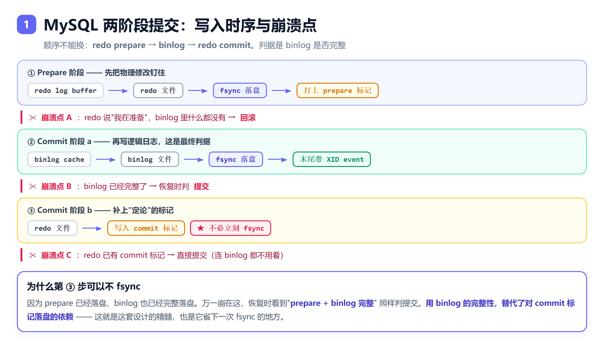
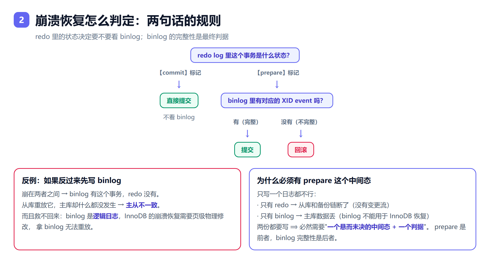

# 2026.09.11 影石面经八股（MySQL / Redis / MQ）

> 来源：影石 Insta360 后端面经题单整理 + 逐题深挖。配图在 `assets/`，由 `assets/src/render.sh` 生成。

---

# 一、MySQL

## 1. B 树 vs B+ 树，为什么用 B+ 树

- **B 树**：key 和 data 存在所有节点上，数据分散在各层。
- **B+ 树**：只有叶子节点存数据，非叶子节点只存 key 做索引；叶子之间用**双向链表**串起来。

选 B+ 树的三个理由：

1. **树更矮 → IO 更少**：非叶子节点不存数据，一个 16KB 页能塞上千个 key（bigint + 页号约 14B），扇出大、层数少。
2. **查询性能稳定**：数据全在叶子层，任何查询路径等长；B 树可能在非叶子就命中，快慢不一。
3. **范围查询友好**：顺着叶子链表扫即可；B 树要中序遍历、来回回溯父节点。

对比其他结构：红黑树是二叉树，千万级数据高度约 24 层，磁盘 IO 太多；哈希等值查询 O(1) 但不支持范围和排序。

## 2. B+ 树一个 page 多大

- InnoDB 默认 **16KB**（`innodb_page_size`，可配 4/8/16/32/64KB），一次磁盘 IO 读一个页。
- 非叶子节点约 `16KB ÷ 14B ≈ 1000+` 个 key；叶子节点按一行 1KB 算放 16 行。
- 三层：`1000 × 1000 × 16 ≈ 1600 万行`。**根节点常驻内存，实际只要 2 次磁盘 IO**。

## 3. 聚簇索引与回表

- **聚簇索引**：索引和行数据在一起，叶子节点就是整行。InnoDB 主键索引即聚簇索引，**一张表只有一个**。
- **二级索引**：叶子节点存**主键值**。查到主键后回聚簇索引捞整行 → **回表**。
- **覆盖索引**：要的列都在二级索引里 → 不回表（Extra 显示 `Using index`）。
- 两个推论：**为什么用自增主键**（顺序插入避免页分裂；主键越长二级索引越大）、**为什么别用 UUID**（随机插入频繁页分裂 + 碎片）。

## 4. 索引失效场景

1. 索引列上做**运算/函数**：`where id + 1 = 5`、`where date(create_time) = '2020-01-01'`
2. **隐式类型转换**：`phone` 是 varchar 却写 `where phone = 13800000000`
3. **前导模糊**：`like '%abc'` 失效，`like 'abc%'` 有效
4. **OR 连了非索引列**
5. 不满足最左前缀
6. `!=`、`not in`、`is not null` 可能失效（看优化器，不是绝对）
7. 数据量少时优化器主动全表扫

反常识点：**`is null` 能走索引，`is not null` 往往不能**。

## 5. 最左前缀

联合索引 `(a,b,c)` 按 a→b→c 排序，于是：

| 条件 | 用上的列 | 说明 |
|---|---|---|
| `a` / `a b` / `a b c` | 全部 | 左前缀连续 ✅ |
| `a c` | 只有 a | **跳过 b 就断了** |
| `a = 1 and b > 2 and c = 3` | a、b | **b 是范围查询，破坏 c 的有序性** |

设计结论：**等值查询的列放前面，范围查询的列放最后**；中间不能跳列。8.0 有"索引跳跃扫描"兜底但别依赖。

## 6. explain 定位慢 SQL

先用慢查询日志（`slow_query_log` + `long_query_time`）或 `pt-query-digest` 找出目标 SQL，再 explain。看四列：

- **type**：`system > const > eq_ref > ref > range > index > ALL`，出现 **`ALL` / `index`** 要警惕。
- **key** vs **possible_keys**：能看出"有索引但没用上"。
- **rows**：预估扫描行数。
- **Extra**：`Using index`（覆盖索引，好）、`Using filesort`（额外排序，慢）、`Using temporary`（临时表，慢）、`Using index condition`（索引下推 ICP）。

8.0.18+ 用 **`explain analyze`** 看真实执行时间，比预估的 `rows` 靠谱。

## 7. 隔离级别与幻读

| 级别 | 脏读 | 不可重复读 | 幻读 |
|---|---|---|---|
| 读未提交 RU | ✗ | ✗ | ✗ |
| 读已提交 RC | ✅ | ✗ | ✗ |
| **可重复读 RR（默认）** | ✅ | ✅ | ✅ |
| 串行化 | ✅ | ✅ | ✅ |

三种问题：**脏读**读到别的事务未提交的数据；**不可重复读**同一行的值变了；**幻读**范围查询的行数变了。

### MySQL 的 RR 靠什么防幻读——两条路各管一半

- **快照读**（普通 `select`）→ **MVCC**，整个事务读同一份快照，别人插的行看不见。
- **当前读**（`for update` / `update` / `delete`）→ **临键锁/间隙锁**，物理上挡住插入。

### 但 MVCC 单独防不住幻读（重要）

经典例子：

| 时刻 | 事务 A | 事务 B |
|---|---|---|
| T1 | `begin;` | |
| T2 | `select * from t where d = 5;` → 返回**空**（快照定格） | |
| T3 | | `begin; insert into t values(5,5,5); commit;` |
| T4 | `update t set d = 100 where d = 5;` → **影响 1 行** ⚠️ | |
| T5 | `select * from t where d = 5;` → 空 | |
| T6 | `select * from t where d = 100;` → **返回 B 插入的那行！** | |

根因：T4 的 update 是**当前读**，看到了 B 新插的行并改了它，这行的 `DB_TRX_ID` 变成 A；而 MVCC 规则里"**事务能看见自己的修改**"，于是这行就出现在 A 的快照读里了。

**结论**：MySQL 的 RR **没有完全解决幻读**——纯快照读靠 MVCC、纯当前读靠间隙锁，但两者混用时仍会幻读。要彻底防住得上 Serializable。

## 8. MVCC

三个部件：

1. **隐藏列**：每行有 `DB_TRX_ID`（最近改这行的事务 ID）和 `DB_ROLL_PTR`（指向 undo 的回滚指针）。
2. **undo log 版本链**：每次修改留一份旧版本，靠 `DB_ROLL_PTR` 串成链。
3. **Read View**：快照读时生成，含 `m_ids`（活跃未提交事务 ID 列表）、`min_trx_id`、`max_trx_id`、`creator_trx_id`。

可见性判断（沿版本链从新往旧找）：

```
trx_id <  min_trx_id  → 已提交，可见 ✅
trx_id >= max_trx_id  → 事务还没开始，不可见
trx_id 在 m_ids 里     → 当时还活着，不可见
```

**RC 与 RR 的差别只有一句：Read View 什么时候生成。**

| | Read View 生成时机 | 结果 |
|---|---|---|
| **RC** | **每次** select 都重新生成 | 能看到新提交的数据 → 不可重复读 |
| **RR** | 只在**第一次** select 时生成，之后复用 | 整个事务看同一份快照 |

## 9. undo / redo / binlog 三兄弟

| | undo log | redo log | binlog |
|---|---|---|---|
| 归属 | InnoDB | InnoDB | **Server 层** |
| 类型 | 逻辑日志（反向操作） | **物理日志**（页的字节修改） | 逻辑日志（SQL / 行变更） |
| 用途 | **回滚 + MVCC 版本链** | **崩溃恢复** | **主从复制、备份恢复** |
| 写法 | 随机 | **循环写**（固定大小） | 追加写 |

- **WAL**：先写 redo、再择机刷数据页，所以提交快、崩了能重放。
- **redo 循环写**：`write pos` 追 `checkpoint`，写满一圈必须先推进 checkpoint。
- **undo 分两种**：insert undo（回滚后即可删）、update undo（MVCC 还要用，不能马上删）。

## 10. 两阶段提交（redo 与 binlog 的一致性）

问题：一个事务要写两种日志（redo 在 InnoDB 层、binlog 在 Server 层），分开写中间崩了就主从不一致。

### 写入时序



```
① Prepare 阶段：redo prepare → fsync 落盘          ← 崩溃点 A
② Commit 阶段 a：binlog → fsync 落盘（带 XID）      ← 崩溃点 B
② Commit 阶段 b：redo 写 commit 标记（不必立刻 fsync）← 崩溃点 C
```

**顺序不能换**：先 redo prepare → 再 binlog → 最后 redo commit。因为判据（binlog）必须先于最终结论落盘。

### 崩溃恢复的判定规则



```
redo 里是 commit 标记  → 直接提交（不看 binlog）
redo 里是 prepare 标记 → 看 binlog 是否完整：
                          完整   → 提交
                          不完整 → 回滚
```

- **binlog 完整性怎么判**：每个事务末尾有 **`XID_EVENT`**，恢复时拿 redo prepare 里的 XID 去 binlog 找对应的 XID event；找到即完整。另有 `binlog_checksum=CRC32` 校验文件。
- **为什么最后一步不用 fsync**：prepare 已落盘 + binlog 已完整落盘，崩在这里照样判提交。**用 binlog 的完整性替代了对 commit 标记落盘的依赖**——这是设计的精髓，也省下一次 fsync。

### 为什么必须有 prepare 中间态

- 只写 redo → 从库和备份链断了；只写 binlog → 主库数据丢（binlog 是逻辑日志，无法用于 InnoDB 的页级恢复）。
- 两份都要写 ⟹ 必然需要"**一个悬而未决的中间态 + 一个判据**"：prepare 是前者，binlog 完整性是后者。

### 组提交（group commit）

按上面时序一个事务要 2~3 次 fsync，高并发下 fsync 是纯瓶颈。5.7 起把三阶段都做成组提交，一次 fsync 带一批：

```
Flush 阶段：各事务 binlog cache 写文件（不 fsync），【串行排序】保证顺序一致
Sync 阶段： fsync binlog —— 一组一起刷，只有一个"领导者"去做
Commit 阶段：按顺序写 redo commit，释放事务
```

调优参数：`binlog_group_commit_sync_delay`（延迟微秒数，攒更多事务，用延迟换吞吐）、`binlog_group_commit_sync_no_delay_count`（攒够多少立即刷）。

**双 1 配置**：`sync_binlog=1` + `innodb_flush_log_at_trx_commit=1` → 保证不丢一个事务，代价是每事务至少两次 fsync。

### 与分布式 2PC 的区别（别混）

| | MySQL 内部 2PC | 分布式 2PC（XA） | TiDB Percolator |
|---|---|---|---|
| 参与者 | redo / binlog 模块（**同进程**） | 多个数据库资源 | 多个 TiKV region |
| 协调者 | **引擎内部**（binlog 扮演） | **外部 TM** | **无中心者**，primary key 仲裁 |
| 解决 | 单机两份日志一致 | 跨节点原子提交 | 快照隔离 + 线性一致 |
| 时间戳 | 无 | 无 | **TSO**（PD 分配） |
| 恢复 | binlog 完整性 | TM 日志 | 有锁就问 primary |

**Percolator 要点**：Client 从 PD 拿 `start_ts` → Prewrite 写锁+数据（第一个 key 当 **primary**）→ 拿 `commit_ts` → 先提交 primary（**primary 成功 = 整个事务必成功**）→ 异步提交 secondary。恢复时遇到锁就去问 primary 的状态。用 primary key 当仲裁点，**去掉了中心协调者**。

**2PC 与 Raft 不是竞争关系**：2PC 管"多个分片怎么原子提交"（事务协议），Raft 管"同一份数据多副本怎么一致"（复制协议）。TiDB = 上层 Percolator 2PC + 下层 Raft 复制。

## 11. 间隙锁加锁过程（UID 3,5,7 例题）

题：索引里只有 3、5、7，RR 下执行 `update ... where uid > 3 and uid < 5`，加什么锁？

**答案：间隙锁 `(3,5)`**，不锁 uid=7，也不锁 uid=5 这一行。

### 三种行锁

```
临键锁 Next-Key Lock = 间隙锁 Gap Lock + 记录锁 Record Lock
          (3, 5]     =   (3, 5)      +      [5, 5]
```

| 模式 | 区间 | 左端 prev | 右端 self |
|---|---|---|---|
| **临键锁** | `(prev, self]` | 开（不含） | 闭（**含**） |
| **记录锁** | `[self, self]` | —（间隙去掉） | 闭（含） |
| **间隙锁** | `(prev, self)` | 开（不含） | 开（**也不含**） |

**关键：锁永远以自己为右端点、回头看左边那段空隙，从不越界去碰前一条记录。** 相邻记录的临键锁首尾相接、不重不漏：

```
记录3 的临键锁：(-∞, 3]
记录5 的临键锁：(3, 5]
记录7 的临键锁：(5, 7]
supremum 伪记录：(7, +∞]
```

### 加锁过程的伪代码

```
用 WHERE 条件定位索引游标（决定起点）
loop:
    读下一条索引记录 R
    if R 满足 WHERE:
        加临键锁 = 间隙(上一条, R) + 记录[R]     # 命中的记录
        continue
    else:                     # R 是第一条不满足条件的记录 = 扫描终点
        加间隙锁(上一条, R)    # 只锁间隙，R 自己不加锁
        break
# 终点之后的记录：从未被读入 → 什么都不加
```

### 套到本题

```
索引：   -∞      [3]       [5]       [7]      +∞
                   │         │
              （3 不被访问）   │
                    └─────────┤
                       间隙锁 (3,5)          ← 答案

记录 3：uid > 3 ✗ → 不在加锁流程里
记录 5：满足 >3 但不满足 <5 → 第一条不满足条件的记录
        → 本应是临键锁 (3,5]，但记录不满足条件 → 行锁部分退掉 → 只留间隙锁 (3,5)
记录 7：扫描已终止，从未被访问 → 不加锁
```

外加固定的表级**意向写锁 IX**。

### 可观测效果

| 另一事务的操作 | 结果 | 原因 |
|---|---|---|
| `insert uid = 4` | **阻塞** | 插入意向锁 vs 间隙锁 (3,5) |
| `insert uid = 2` / `6` | 通过 | 落在没锁的间隙 |
| `update uid = 5` 那行 | 通过 | 行锁没加 |
| 再跑同样的 update | 通过 | **间隙锁之间兼容**，只跟插入意向锁冲突 |

### 三条决定加锁结果的要素

```
① WHERE 条件      → 扫描路径（起点、终点各在哪条记录）
② 逐条判断"是否满足 WHERE"
     满足   → 临键锁（间隙 + 自己）
     不满足 → 只留间隙锁（仅扫描终点那一条）
③ 索引里的邻居记录 → 决定间隙的实际左右端点
④ 边界之后没被扫到 → 不加锁
```

**一句话：条件是"路线"，命中是"模式"，数据是"边界"。**

### 数据一变答案就变（这才是真考点）

| 索引数据 | 条件 | 加什么锁 |
|---|---|---|
| 3, 5, 7 | `>3 and <5` | 间隙锁 `(3,5)` |
| 3, 5, 7 | `>=3 and <5` | 临键锁 `(-∞,3]` + 间隙锁 `(3,5)` |
| 3, 4, 5 | `>3 and <5` | 临键锁 `(3,4]` + 间隙锁 `(4,5)` |
| 3, 4, 5 | `>=3 and <5` | 临键锁 `(-∞,3]` + `(3,4]` + 间隙锁 `(4,5)` |
| 3, 5, 7 | `uid = 5`（唯一索引命中） | 记录锁 `[5,5]` |
| 3, 5, 7 | `uid = 4`（值不存在） | 间隙锁 `(3,5)` |

### 前提与例外

- **只在 RR 下成立**。RC 下 InnoDB 会**跳过间隙锁**（`trx->skip_gap_locks()` 在 RC/RU 下返回 true）→ 加的是记录锁 → 防不住幻读，但并发高、死锁少。RC 还有**半一致性读**：UPDATE 时读到不匹配的行就放锁。
- **RC 也并非零间隙锁**：**唯一性冲突检查**和**外键约束检查**仍会用临键锁。
- **没索引时是灾难**：where 用不上索引 → 全表扫描 → 对扫过的每条记录加临键锁，效果接近锁表。

## 12. CDC 读的是 binlog

**必须开 `binlog_format = ROW`**，因为 CDC 需要变更的**前镜像/后镜像**；STATEMENT 只有 SQL 原文，`update t set x = x + 1` 根本还原不出具体值。

**为什么不是 redo**：redo 是**物理日志**（页级字节修改），没有行级语义；而且是**循环写**、会被覆盖，历史留不住；格式也不对外保证兼容。binlog 是逻辑日志、持久追加、格式稳定，还有 file+position / GTID 的位点语义。

**工作原理**：CDC 工具**伪装成 MySQL 的从库**，向主库发 `COM_BINLOG_DUMP`，主库的 dump 线程推送 binlog 事件流（就是主从复制那套协议）→ 账号需要 `REPLICATION SLAVE` 权限。

细节：

- **三种行事件**：`WRITE_ROWS_EVENT`（insert，只有后镜像）、`UPDATE_ROWS_EVENT`（前后镜像都有）、`DELETE_ROWS_EVENT`（delete，只有前镜像）。
- **`binlog_row_image`**：默认 `FULL`（前后镜像含所有列）；设成 `MINIMAL` 时前镜像只有主键、后镜像只有被改列——下游要还原完整行得自己关联，常见坑。
- **位点**：file+position 或 GTID（推荐，主从切换不错位）。
- **DDL 是 Query event**（不是行事件），要单独处理。
- **异步消费**，天然有延迟。

常用工具：**Canal**（阿里）、**Debezium**（Flink CDC 底层也用它）、**Maxwell**。

追问"为什么不用触发器"：触发器拖慢主库写入、难以捕获删除前数据、容易被绕过；binlog 对主库几乎零侵入且能拿到完整前后镜像。

---

# 二、Redis

## 13. 数据类型与底层

| 类型 | 底层结构 | 典型场景 |
|---|---|---|
| String | **SDS**（带 len/free，二进制安全） | 缓存、计数、分布式锁 |
| List | **quicklist**（ziplist 组成的双向链表） | 消息队列、最新列表 |
| Hash | ziplist（小）/ hashtable（大） | 存对象 |
| Set | intset（纯整数）/ hashtable | 去重、共同好友 |
| ZSet | **skiplist + dict** | **排行榜**、延时队列 |
| Bitmap | 基于 String 的位操作 | 签到、UV、布隆过滤器 |

ZSet 用两个结构配合是关键：**dict 负责 O(1) 按成员查分数，skiplist 负责按分数范围查询**。

SDS 相比 C 字符串三个改进：O(1) 取长度、二进制安全（不靠 `\0` 判结尾）、预分配减少扩容。

## 14. 分布式锁与锁续期

```bash
SET lock_key unique_value NX PX 30000   # 原子：不存在才设置 + 30s 过期
```

- 解锁必须用 **Lua 脚本**保证"判断 value 是不是自己的"+"删除"原子，否则可能删掉别人的锁。
- **锁续期解决什么**：业务执行超过 TTL，锁自动释放被别人拿到 → 两个客户端同时执行。本质是"锁有效期"和"业务时长"竞赛。
- **方案：看门狗（watchdog）**。Redisson 加锁成功后注册后台任务，每 `TTL/3`（默认 10s）检查一次，仍持有就续期回 30s，直到显式释放。
- **怎么判断业务线程还在执行**：Redisson 的锁对象带**重入计数**，计数器 > 0 就续期；释放时递减，减到 0 才真正释放、停掉看门狗。
- **Redlock 的争议**：多节点投票（N 个独立 Redis 过半成功）理论上防单点，但 Kleppmann 指出在**时钟漂移和 GC 停顿**下不安全。实践中更常见"单实例 + 看门狗 + 哨兵/集群高可用"。

## 15. 哨兵 vs 集群

| | 哨兵 Sentinel | 集群 Cluster |
|---|---|---|
| 解决什么 | **高可用**（自动故障转移） | **容量扩展**（分片）+ 高可用 |
| 数据 | 主从复制，**一份全量** | 分片，**16384 个 slot** 分布多节点 |
| 上限 | 受单机内存限制 | 可水平扩展 |
| 机制 | 主观下线 → 客观下线（超 quorum）→ 哨兵选举 leader → 选新主 | key 经 CRC16 算 slot 路由，`MOVED`/`ASK` 重定向 |
| 限制 | 容量上不去 | 多 key 操作要同 slot（`{hash tag}`）、不支持多库 |

一句话：**哨兵是"高可用方案"，集群是"分片 + 高可用方案"。**

## 16. 缓存穿透 / 击穿 / 雪崩

| | 是什么 | 方案 |
|---|---|---|
| **穿透** | 查的数据**根本不存在**，缓存和 DB 都没有，每次都打 DB | ① 缓存空值（短过期）② **布隆过滤器**前置拦截 ③ 参数校验 |
| **击穿** | **单个热点 key 过期**的瞬间，大量并发同时打 DB | ① 分布式锁/互斥，只放一个请求查 DB ② 热点 key 不过期 ③ 逻辑过期 + 异步更新 |
| **雪崩** | **大批 key 同时过期**，或 Redis 整体宕机 | ① 过期时间加**随机值**打散 ② 多级缓存 ③ 限流降级熔断 ④ 集群高可用 |

记忆抓手：**穿透 = 数据不存在；击穿 = 热点那一个失效；雪崩 = 一大批同时失效。**

## 17. bitmap 底层

- **不是独立数据类型**，而是**基于 String 的位操作**——底层就是 SDS 的字节数组，`SETBIT` 直接改某个 bit。
- 上限：String 最大 512MB → 能表示 **2³² ≈ 42.9 亿**个位。
- 命令：`SETBIT` / `GETBIT` / `BITCOUNT` / `BITOP` / `BITPOS`。
- 空间：**1 亿用户签到只用 12.5MB**（10⁸ bit ÷ 8 ÷ 1024²）。
- 注意：`SETBIT` 的 offset 很大会触发自动扩容（内存可能突增）；`BITCOUNT` 是 O(N) 但 N 是**字节数**。

## 18. 布隆过滤器

- 结构：**一个位数组 + k 个哈希函数**。
- **添加**：key 经 k 个哈希算得 k 个位置，全置 1。
- **查询**：k 个位置**全是 1** → 可能存在；**任意一个是 0** → **一定不存在**。
- **核心特性：只有假阳性，没有假阴性**。说"不存在"绝对可靠，说"存在"可能误判——因为添加时所有位都置 1 了，只要不删，查询必然全为 1。
- 误判率 `p ≈ (1 - e^(-kn/m))^k`（m 位数组大小、n 元素个数、k 哈希个数），**k 取 `(m/n)·ln2` 最优**。
- **不支持删除**（某位为 1 无法判断是谁置的）→ 要删用 **Counting Bloom Filter**（位换计数器）。
- 用途：**缓存穿透防护**、爬虫 URL 去重、Redis 的 `BF.ADD`（RedisBloom 模块）。

---

# 三、MQ

## 19. RabbitMQ：丢失、重复、幂等、积压

### 丢失的三个环节，逐段防

| 环节 | 为什么会丢 | 方案 |
|---|---|---|
| 生产者 → Broker | 网络问题没送到 | **publisher confirm**（异步确认）+ return 回调 + 本地消息表兜底 |
| Broker 内部 | 消息在内存没落盘，Broker 挂了 | **队列持久化 + 消息持久化**（`delivery_mode=2`）+ 镜像队列/quorum queue |
| Broker → 消费者 | 消费者处理到一半挂了 | **手动 ack**，成功才 ack；失败 nack 重入队或进**死信队列** |

### 重复消费 → 幂等

根因：ack 丢了导致重投、或消费失败重试。三种手段：

1. 业务唯一 ID / messageId 建**去重表**（数据库唯一索引，重复插入直接冲突）
2. Redis `SETNX` 记录已消费 ID
3. **状态机**：只允许特定状态流转，重复消息因状态不符被忽略

### 积压

原因：消费慢、消费者挂了、突发流量。方案：

1. 扩消费者（会破坏顺序性）
2. 消费者**批量拉取 + 批量处理**
3. 临时起消费者把消息快速转到新队列，慢慢消化
4. 优化消费逻辑（异步化、减少 DB 往返）
5. 生产端限流，先止血

### 顺带：顺序性

只有"**一个队列 + 一个消费者**"才能保证顺序；多消费者必然乱序。要保序就用单队列单消费者，或用一致性哈希把同一业务 key 路由到同一队列。

## 20. Seata AT 模式

**角色**：TC（独立的 Seata Server，全局事务协调者）、TM（发起方，`@GlobalTransactional`）、RM（各微服务的数据库）。

**两阶段**：

```
一阶段：各分支执行本地事务 → 【直接提交】（不等别人）
        同时代理数据源拦截 SQL，生成 before/after 镜像写入 undo_log
        注册分支到 TC，申请全局锁
二阶段：
  全部成功 → TC 通知各分支【异步删除 undo_log】（快，几乎无开销）
  有失败   → 用 undo_log + before image 做【反向补偿】还原数据
```

**三个关键点**：

1. **一阶段就提交本地事务**——不像 XA 长时间持有数据库锁，性能好得多；代价是回滚只能靠**补偿**。
2. **需要全局锁**：一阶段已提交，补偿前不能让别人改这些行，否则 before image 还原会覆盖别人的修改。
3. **默认隔离级别是读未提交**——一阶段已提交，别人能看到"全局事务未结束但数据已改"的中间态。这是 AT 的软肋；要读已提交得靠 `@GlobalLock` 或 `select ... for update` 兜。

**与 XA 对比**：XA 一阶段 prepare 不提交、锁持有到二阶段，锁重但隔离性好；AT 一阶段直接提交、靠 undo_log 补偿回滚，性能好但要自己防脏读。
